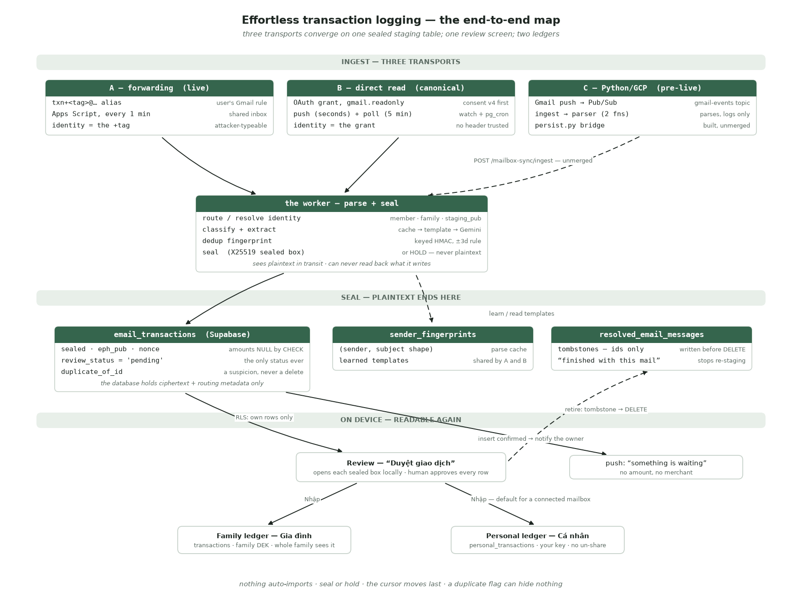
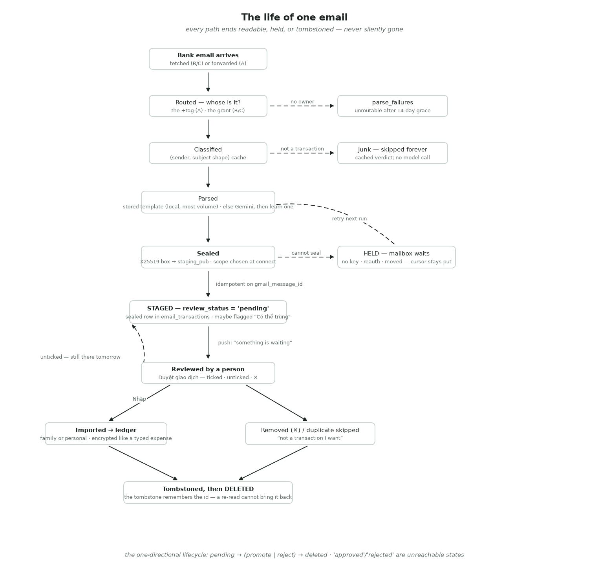
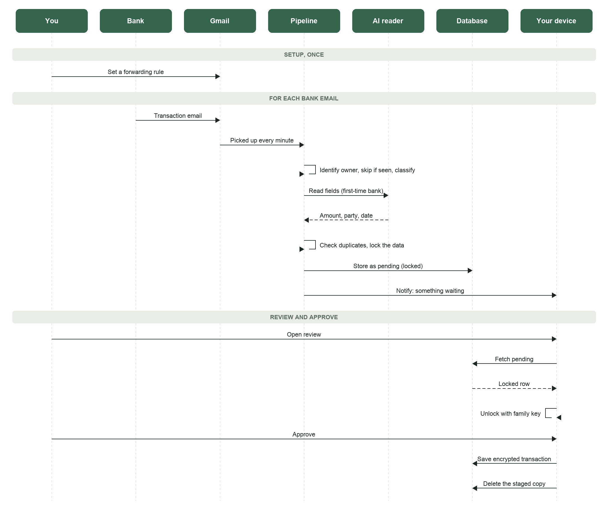
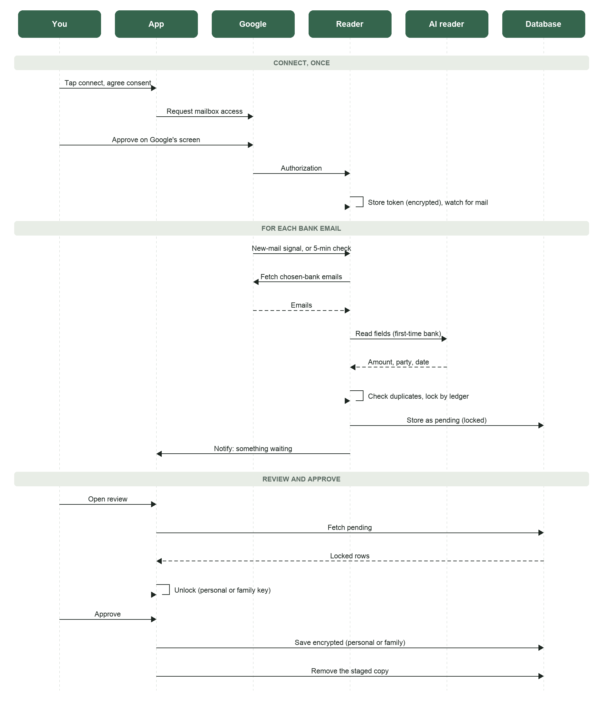
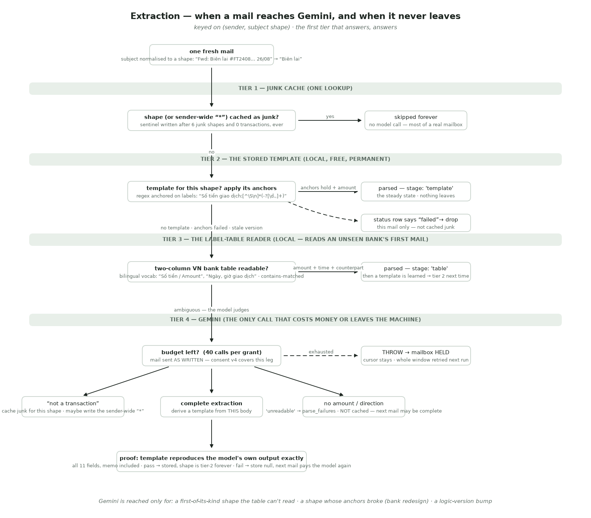
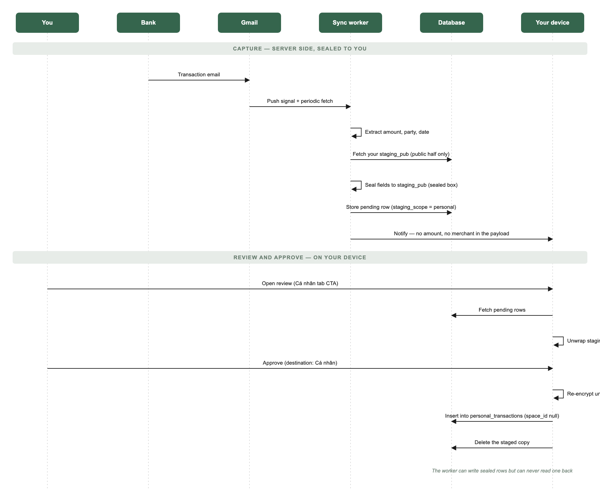
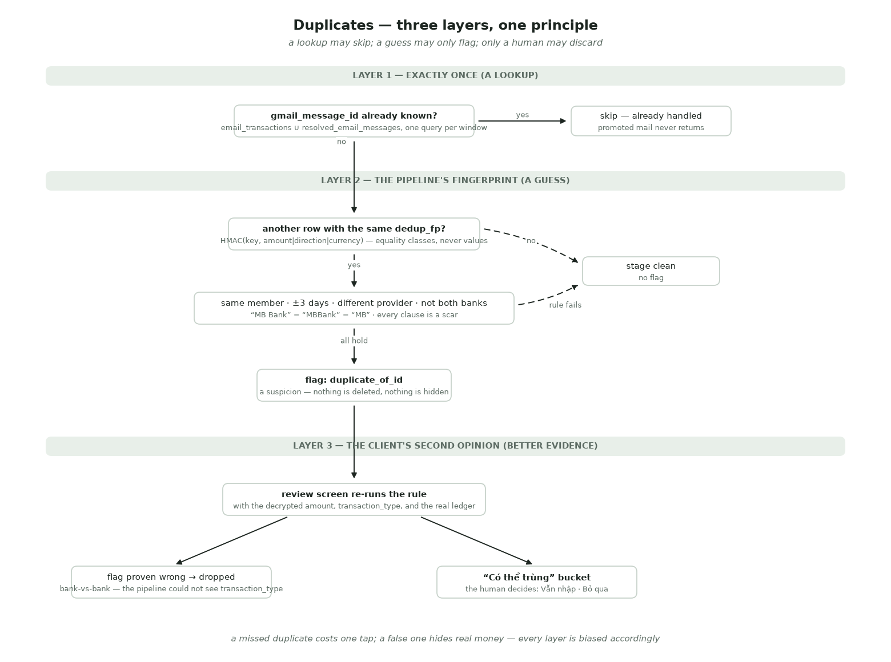

# Effortless Transaction Logging — from a bank's email to the ledger

The umbrella spec for FamilyHub's passive capture feature: a bank emails you
about a purchase, and the transaction appears in your ledger after one
approving tap — no typing, no CSV export, no bookkeeping. This document covers
the whole chain: how emails enter the system (three transports), how they are
parsed, how the result is staged so the database cannot read it, how a person
reviews it, and how an approved row becomes an encrypted ledger entry.

> **Status, 2026-08-30.** Live in production for allowlisted members, on two
> transports: forwarding (Apps Script) and OAuth direct read (Edge Functions —
> the canonical path today). A third implementation, the backend team's
> Python/GCP pipeline, reads and parses real mail but does not persist yet;
> it is specified here as **pre-live**. This is the first end-to-end spec of
> the feature — reconstructed from the live code, schema and pipeline docs,
> not a forward-looking design.

> **Audience & layering.** Part 1 (Behaviour) is for everyone — product,
> design, QA, onboarding. Part 2 (Technical Appendix) is for engineers.
> Part 3 (Release Notes) is the running log of every deployment that changed
> what this document describes — **check it first if the doc and production
> seem to disagree**. The [transports table](#5-the-three-transports-at-a-glance)
> is the one-glance summary; the four diagrams are the zoom-out views.

> **How this spec relates to its siblings.** This is the wide view. Two
> stages of the chain have their own deep specs and are *summarised* here:
> the review screen (`transaction-review-spec.md`) and the personal-ledger
> destination (`personal-ledger-spec.md`). `bank-email-capture-spec.docx` is
> the earlier executive-level summary of the same feature; this document
> supersedes it in depth but not in audience.

---

# Part 1 — Behaviour

## 1. Summary

- Banks and wallets already email a notification for nearly every transaction.
  FamilyHub turns that mail into ledger entries: an unattended pipeline reads
  the email, extracts amount / counterparty / date, and stages the result for
  review. A person approves each row with one tap; nothing is ever imported
  automatically.
- There are two ways to feed emails in today — **forward** them to a personal
  FamilyHub address, or **connect your Gmail** once and let FamilyHub fetch
  bank mail directly. Both end at the same review screen. A third
  implementation (the backend team's Python pipeline) is built and pre-live.
- Every staged row is **sealed**: encrypted to a public key before it reaches
  the database, so neither Supabase nor FamilyHub can read an amount back.
  Approved rows are then encrypted with the family's key (or your personal
  key) exactly like a hand-typed expense.
- Each captured row can be filed into the **family ledger** or your private
  **personal ledger**, chosen per row at review. For a connected mailbox,
  personal is the default.

## 2. Why this exists

- FamilyHub had two ways money reached the ledger, and both require the user
  to *do* something: type an expense, or export and import a CSV. Both are
  acts of bookkeeping, and bookkeeping is the thing people stop doing in week
  three.
- Bank notification mail is a complete, timely, structured record of household
  spending that the user already receives and mostly ignores. If those emails
  reach us, the work of writing a transaction down disappears; what is left is
  a quick review whose whole purpose is the one thing a machine cannot supply
  — *what the money was for*.
- The design was proposed and prototyped by Trang (Growth) and validated
  against real forwarded Vietnamese bank emails before the first migration
  (`0025`) was written.

## 3. Who can read what — the trust model

Everything below is easier to hold if you keep the custody chain first. A
transaction crosses **three domains**, and almost every design decision is
about what each one is allowed to know.

| Domain | Holds | Can read a transaction? |
|---|---|---|
| **Google** — Gmail, Apps Script, Gemini | the raw email; (transport A) the service-role key and `DEDUP_FP_KEY` | **Yes, in transit.** The pipeline that parses mail sees plaintext — that is the honest boundary. |
| **Supabase** — Postgres, Edge Functions | ciphertext + routing metadata, `staging_pub` | **No.** Sealed rows are opaque to the database. The Edge worker sees plaintext in transit (transport B) but stores only ciphertext. |
| **The family / the person** — their devices | the family DEK, the personal DEK, the staging private keys | **Yes.** The only place a staged row becomes readable again. |

Two consequences worth internalising:

- **Sealing does not hide anything from the pipeline; it hides it from the
  database.** The worker that parses a family's mail can never read the row it
  wrote — but it read the mail to write it. Consent (§8) covers that leg.
- **Keys are deliberately split across companies.** `DEDUP_FP_KEY` lives with
  the pipeline (Apps Script Properties / Edge secrets), never in Postgres, so
  a database dump cannot be attacked with it.

## 4. The journey, end to end



### 4.1 Setting up, once

The door is **"Khoản thu chi từ email"** — on the family Finance tab and on
the Cá nhân tab. If nothing is set up yet, a chooser names the two transports:

- **Connect Gmail (direct read)** — listed first because it is better for
  almost everyone who can use it: one tap instead of a mail-client filter
  rule, and it reads history rather than starting from now. Consent is
  recorded in the app (v4) *before* Google's own consent screen. At connect
  you choose two things: where new rows go by default (**Cá nhân** is the
  default) and how far back the first read reaches (90 days by default, up to
  a year).
- **Forward your bank email** — you receive a personal `txn+<tag>@…` address
  and add a Gmail forwarding rule yourself. It stays because it is the only
  thing that works for a mailbox Google does not host.

Neither is labelled "recommended": the thing that actually decides it is
whether the bank writes to a Gmail address, which the person knows and we do
not. The connect flow itself is two steps — step 1 only earns the tap and
holds no controls; step 2 is the three decisions as one grouped list, every
answer pre-filled with a working default.

**One mailbox per person, for now.** Connecting a second Google account
replaces the first — stated on the status screen, because "Đổi" replacing a
mailbox is not something anyone would guess.

### 4.2 Then nothing happens — and that is the point

Capture is passive. Mail arrives, the pipeline reads it (within seconds on
Gmail push, within five minutes on the poll for direct read; within a minute
for forwarding), extracts the fields, seals them, and stages the row. The
user does nothing and sees nothing yet.

### 4.3 A nudge, not a report

When something is staged, the owning member gets one push: **"something is
waiting"** — never an amount, never a merchant. A burst of five emails is one
notification. Only the owner is told; the family is not, because even the
*fact* of a pending transaction is theirs. Tapping it opens the review
screen; a badge on the "Khoản thu chi từ email" rows carries the pending
count.

### 4.4 The review — "Duyệt giao dịch"

The human gate. Rows arrive as cards organised by what they need from you:
**Cần bạn xem** (missing category/date/amount), **Tụi mình để riêng**
(possible duplicates, money-in, card payments — decided for you, reversibly),
then the ready list grouped by date. Every card can be ticked (import),
unticked (keep for later — *not* a dismissal), or removed with ✕ (gone for
good). Inside a card you can fix the description — the field the whole screen
exists for — the category (pre-filled by a confidence cascade, §19), the
amount, the date and time, who paid, and **where it goes**:

- **🏡 Gia đình** — the shared ledger; the whole family sees it (and a
  read-only mirror lands in your personal book).
- **🔒 Cá nhân** — your private ledger; the family never sees it, and there
  is no un-share.

Bulk tools appear over any selection (one category, one destination, delete),
and a standing per-source route ("MB Bank → Cá nhân") can be set once and
remembered. Full behaviour: `transaction-review-spec.md`.

### 4.5 Import

Tapping **Nhập N** writes the ticked rows into their chosen ledgers with the
same encryption as hand-typed entries, then retires the staged copies
(server-side delete, tombstoned first). Personal rows are written before
family rows; any personal failure stops the batch before anything staged is
lost. An imported row is indistinguishable from a typed one — same tables,
same ciphertext, same budgets and charts.

## 5. The three transports at a glance

| | **A — Forwarding** | **B — Direct read** | **C — Python/GCP** |
|---|---|---|---|
| Status | Live | **Live — canonical** | **Pre-live** (parses, does not persist) |
| Runs on | Google Apps Script, shared inbox | Supabase Edge Functions + pg_cron | GCP Cloud Functions (Python) |
| Code root | `pipeline/bank-email-pipeline.gs` | `supabase/functions/_shared/mailbox/*.mjs` | `earthy/serverless/functions/*` |
| Email enters by | user's forwarding rule → `txn+<tag>@…` | OAuth grant; we fetch from their mailbox | OAuth grant + Gmail push |
| Identity is | the `+tag` in the alias (attacker-typeable, so parsed defensively) | **the grant** — no header is trusted | the grant (`connected_accounts`) |
| Trigger | 1-minute time trigger | Gmail push (seconds) + 5-minute poll | Gmail push over Pub/Sub |
| Extraction | template cache → Gemini | template cache → label-table → Gemini | regex patterns → Gemini |
| Writes to | `email_transactions` (sealed) | `email_transactions` (sealed) | ends at `# TODO: persist`; bridge to `/ingest` unmerged |
| Setup burden | a filter rule done correctly, an alias not to lose | one tap on Google's screen | (operator-run `make connect` today) |
| Works for | any mailbox that can forward | Gmail only | Gmail only |

A and B share everything downstream — the staging table, the
`sender_fingerprints` parse cache, the dedup fingerprint key and the review
screen. A template learned by one transport is applied by the other.

## 6. The life of one email



1. **Fetched / received.** Direct read lists only mail from ~157 known bank
   and wallet domains; forwarding reads what the user's rule sends.
2. **Routed.** Whose transaction is this? Forwarding parses the `+tag`; direct
   read answers from the grant. Unroutable forwarded mail is held 14 days
   (onboarding may be mid-flight), then recorded as a parse failure.
3. **Skipped or parsed.** A sender cached as non-transactional is skipped
   forever. A known `(sender, subject shape)` is parsed locally from a stored
   template — no model call. Only a first-of-its-kind mail goes to Gemini,
   and a template is learned from the answer.
4. **Held, sometimes.** If the row cannot be sealed — the family has never
   minted a staging key, the person has never unlocked their personal ledger,
   ownership moved since connect — the mail **waits**. A hold costs one poll
   and loses nothing; there is no plaintext fallback, ever.
5. **Sealed and staged.** The sensitive fields are encrypted to the family's
   (or the person's) staging public key and inserted as `pending`. Likely
   duplicates are flagged, never dropped.
6. **Reviewed.** Imported → written to a ledger, then the staged row is
   tombstoned and deleted. Removed → tombstoned and deleted. Unticked →
   stays pending, still there tomorrow.
7. **Never re-staged.** The tombstone remembers the Gmail message id, so even
   a re-read of an old window cannot bring a finished transaction back.

## 7. Duplicates — a suspicion, never a deletion

One purchase can produce two emails: the bank says "debit 200.000đ", the
wallet says "receipt 200.000đ". They share no identifier — only an amount. So
duplicate detection is a guess, and the system treats its own guesses with
suspicion:

- The pipeline flags likely duplicates (`duplicate_of_id`) but **never
  deletes or hides** — flagged rows land in the review screen's "Có thể
  trùng" bucket with *Vẫn nhập* / *Bỏ qua*. This posture was paid for: an
  earlier version silently filtered flagged rows and a genuine 2.000đ
  transfer disappeared, notification and all.
- The review screen re-runs detection with better evidence (the decrypted
  amount, the transaction type the pipeline cannot read on sealed rows, the
  real ledger) and can overrule a pipeline flag it can prove wrong.
- **A missed duplicate costs one tap; a false one hides real money.** Every
  layer is biased accordingly.
- Known gap: moving money between your own accounts still double-counts —
  two mails, opposite directions, and every rule here matches on *sameness*
  (§24).

## 8. Privacy, consent, and what leaves where

- **Consent before collection.** Direct read requires the `bank_email`
  consent sheet (v4) before Google's screen. The sheet says plainly that a
  first-time bank's mail is sent to an AI service to be read, amounts and
  names included. This replaced token masking on 2026-08-25 — v3 consenters
  agreed to "real values are never sent", so the version bump forces
  re-affirmation against the new text.
- **An AI reads a bank's mail only the first time each mail *format* is
  seen** — and often not even then (most VN bank notices are readable
  locally, §16.1). After that, a learned template parses every later mail of
  that format on-device at the server, permanently; a redesign by the bank
  costs exactly one more model call. Nearly all volume never reaches a
  model.
- **The database can never read a staged row.** Amounts, counterparties,
  references travel only inside a sealed box; the columns are NULL by CHECK
  constraint.
- **Approved rows are end-to-end encrypted** under the family or personal
  key, like every other ledger row. The operator holds ciphertext.
- **Notifications carry nothing** — no amount, no merchant, asserted by test.
- **The raw email body is not stored.** Not sealed, not truncated — absent.
  The user's own mailbox is the better archive, including the property that
  they can delete it.
- **Erasure (PDPL).** Withdrawing consent stops OAuth collection immediately
  (no grace period), disconnects the mailbox, and deletion of stored data
  follows within 72 hours.

## 9. Safety rules

- **Nothing auto-imports.** No scheduled job moves a staged row into any
  ledger; a person taps Import on every row. Automated writers stage, humans
  commit — the same trust posture as CSV import.
- **Seal or hold — there is no third option.** No config flag, no plaintext
  fallback, no code path from "could not seal" to a readable insert.
- **The cursor moves last, and only on a finished window.** Every failure
  here is silent — there is no error page for a transaction that never
  appeared — so re-reading is normal and skipping is unrecoverable.
- **A row that cannot be opened is never silently dropped.** Locked devices,
  stale shells and real tampering all surface as a counted, explained state.
- **A duplicate flag is advice, not an action.** Nothing a machine guessed
  can remove a transaction from a human's sight.
- **Retirement is local-first.** The client remembers what it imported before
  asking the server to delete, so a failed delete cannot cause a double
  import.

## 10. Status and current limits

- **Live:** both transports; the chooser; two-step connect with per-grant
  scope and backfill window; sealed staging (family and personal); learned
  templates; model-supplied category hints; dedup; the review screen with
  per-row destination; promotion into both ledgers; tombstoned retirement;
  notifications; watch auto-renewal; beta gate.
- **Pre-live:** transport C (§15) — parses real Vietnamese bank mail
  correctly, 445 tests green on the bridge, unmerged.
- **Current limits:**
  - Only banks that send email notifications are captured, and only senders
    on the domain list are fetched at all (a missing domain fails silently —
    §21.5).
  - Internal transfers between your own accounts double-count.
  - One mailbox per person; a second Google account replaces the first.
  - Foreign-currency rows stage correctly but the ledger has no currency
    column; conversion is undecided (§24).
  - Refresh tokens expire weekly while the Google app is in Testing status —
    a routine reconnect prompt, not an outage.
  - Sender authenticity (DKIM) is recorded on every row but not yet enforced.

---

# Part 2 — Technical Appendix

## 11. Architecture in one view

Three ingest implementations converge on one staging table and one review
screen. The module maps:

**Transport A — forwarding (Google Apps Script, hand-pasted):**

| Piece | Owns |
|---|---|
| `pipeline/bank-email-pipeline.gs` | The whole run: routing, classification, extraction, sealing, dedup, insert, retention — a single 102 KB file, deployed by paste (§21.3) |
| Shared Gmail inbox | The corridor forwarded mail lands in; swept after 7 days |
| `mailbox_connections` | `txn+<tag>@…` alias → member |

**Transport B — direct read (Supabase Edge Functions, Deno):**

| File | Owns |
|---|---|
| `supabase/functions/mailbox-connect/index.ts` | OAuth: `/authorize` (JWT-verified, returns Google URL as JSON), `/callback` (state-authenticated, stores the grant, registers the watch) |
| `supabase/functions/mailbox-sync/index.ts` | Three routes, all secret-gated: `/push` (Gmail→Pub/Sub), `/ingest` (external-reader handoff), bare POST (cron tick) |
| `_shared/mailbox/senders.mjs` | Which senders are read at all — **the one file standing between "we read bank mail" and "we read everything"** |
| `_shared/mailbox/gmail.mjs`, `mailtext.mjs` | Token exchange, `messages.list/get`, MIME walk, DKIM verdict; HTML → text |
| `_shared/mailbox/extract.mjs`, `templates.mjs`, `labeltable.mjs`, `llm.mjs`, `memo.mjs` | The extraction cascade (§16) |
| `_shared/mailbox/identity.mjs` | Grant → `{memberId, familyId, stagingPub}` and the six holds |
| `_shared/mailbox/sealed-box.mjs`, `stage.mjs` | The seal and the clear/sealed split (§17) |
| `_shared/mailbox/dedup.mjs` | `dedup_fp` + the cross-source rule (§18) |
| `_shared/mailbox/db.mjs` | Every read and write, in one place, as `service_role` |
| `_shared/mailbox/worker.mjs` | The run loop — pure, dependencies injected |
| `supabase/migrations/0088` | pg_cron `*/5` → `_mailbox_sync_tick()` → `net.http_post` |

**Transport C — Python/GCP (`earthy/serverless/`, pre-live):** §15.

**Client (shared by all transports):**

| File | Owns |
|---|---|
| `src/js-data/71-mailbox-ui.js`, `73-mailbox-gate.js` | Forwarding alias UI; beta gate `can_use_mailbox()` |
| `src/js-data/74-autotxn-ui.js` | Transport chooser, two-step connect, scope + backfill chips, status, disconnect (incl. headless stop for erasure) |
| `src/js-data/75-consent-ui.js` | The `bank_email` consent sheet (v4) — must change in the same commit as `llm.mjs` |
| `src/js-data/72-txn-review.js` | Fetch staged rows, open sealed boxes, orchestrate promote/retire |
| `src/js-ui/57-csv-import-review.js`, `56-csv-import-ui.js` | The review engine (shared with CSV import): buckets, category cascade, per-row scope, render, promote |
| `src/js-data/18-staging-keys.js`, `19-personal.js` | Family / personal staging keys, sealed-box open, key-mismatch alarm |
| `src/js-data/40-txn-writes-outbox.js`, `50-writethrough-realtime.js` | The family ledger write + offline outbox; source stamping |
| `src/js-data/55-push.js` | Routes a `txn_review` push tap into the review screen |

## 12. The shared staging contract

### 12.1 `email_transactions` — one table, three writers, one reader

Created in `0025`; ~22 columns in three groups. The clear/sealed split is the
privacy design in schema form — every clear column has to justify itself:

| Stays clear | Why it cannot be sealed |
|---|---|
| `gmail_message_id` NOT NULL UNIQUE | the idempotency key, queried before anything is decrypted |
| `member_id` (nullable since `0092`) | ownership; the RLS policy keys on it |
| `owner_user_id` (`0092`) | ownership for personal-only users, who have no member row |
| `source_provider` | dedup compares bank names *fuzzily*; a hash matches only exactly |
| `occurred_at` | dedup queries a date **range** |
| `dedup_fp` | the keyed equality token that replaces the sealed amount (§18) |
| `duplicate_of_id`, `review_status`, `staging_scope`, `txn_source` | workflow state and provenance, not content |

**Sealed** (NULL in the row, carried inside the box): `amount`, `currency`,
`direction`, `counterparty`, `reference_number`, `transaction_type`,
`raw_extracted`. **Envelope:** `sealed`, `eph_pub`, `nonce`, `enc_v` — the
`email_transactions_sealed_or_plain` CHECK (`0068`) makes the half-sealed
state unwritable: all four envelope columns NULL, or all four set *and* every
sensitive column NULL. (`0065`'s first version forgot `raw_extracted` and
`transaction_type` — the two most content-bearing fields after the amount.)

**`raw_body` is never stored.** ~20KB per row that nothing reads back, when
the original stays in the user's mailbox. `parse_failures` stopped storing it
too (`0068`) — a failure row holding a full plaintext email was a side door
around everything the sealed table protects.

**`review_status` is only ever `'pending'`.** The lifecycle is
one-directional: pending → (promote | reject) → **row physically deleted**.
`'approved'`/`'rejected'` exist in the CHECK but are unreachable;
`promoted_transaction_id` is a dead column.

### 12.2 The supporting tables

| Table | Role |
|---|---|
| `sender_fingerprints` (`0025`) | The parse cache, keyed `(sender_address, subject_template)` — **not sender alone**: one sender can mix transactional and marketing mail. Holds the cached verdict, `transaction_type`, the learned `extraction_regex`, `human_verified`. **Shared by transports A and B.** |
| `mailbox_connections` (`0025`, `0059`) | Forwarding identity: unique `forwarding_alias`, `personal_email`, `member_id`, `verified` |
| `mailbox_grants` (`0087`, +`0089` `0092` `0093`) | The OAuth link: encrypted refresh token, member/family destination, `default_scope`, `backfill_days`, sync cursor, watch expiry, `needs_reauth`. UNIQUE `(user_id, provider)` |
| `resolved_email_messages` (`0090`, re-keyed `0092`) | Tombstones: `(owner_user_id, gmail_message_id, member_id)` — "this mailbox is finished with this message". No amount, no merchant, no date. |
| `parse_failures` (`0025`) | Triage for unroutable/unreadable mail; plaintext-free since `0068` |
| `category_rules`, `known_provider_domains`, `mailbox_beta_access` | Keyword→category seed; bank-picker seed (largely unused); the beta allowlist (`0067`) |
| `family_keys.staging_pub / staging_priv_enc` (`0051`) | The family staging keypair — public half readable by the worker, private half wrapped by the family DEK |
| `personal_keys.staging_pub / staging_priv_enc` (`0091`) | The personal staging keypair — private half wrapped by the **owner's** DEK, never a family key |

### 12.3 Access control

| Object | anon | authenticated | service_role |
|---|---|---|---|
| `email_transactions` | — | SELECT own rows (`0058`: `member_id ∈ my members`, or owner since `0092`); **writes deny-all** | full |
| `mailbox_grants` | — | SELECT own, column-limited — `refresh_token_enc` is not grantable to a browser | full |
| `resolved_email_messages` | — | SELECT own | SELECT/INSERT/DELETE |
| `resolve_email_transactions(uuid[])` (`0060`) | — | EXECUTE — SECURITY DEFINER, re-checks ownership, **deletes nothing rather than erroring** on foreign ids | — |
| `grant_mailbox_access()` | — | — | EXECUTE |
| `disconnect_my_mailbox()` | — | EXECUTE | — |

The `0058` policy is user-based, not `auth_family_id()`-based — which is what
kept a months-long unscoped-dedup bug invisible to clients, and what made the
policy survive personal-only containers. Rows with no `member_id` and no
owner are visible to nobody, on purpose.

The worker runs as **service_role and bypasses RLS** — every scoping filter
must be explicit in its queries. That is not theoretical: the dedup query ran
for months comparing across members before the member filter was added
(§18.2).

### 12.4 Migration ledger

Cite by filename — the numeric sequence has documented collisions.

| File | What it did |
|---|---|
| `0025_bank_email_pipeline` | The six additive tables; no existing table altered |
| `0027`, `0028`, `0029` | Categorisation seed, member routing, mirror-event backfill |
| `0051_family_staging_keys` | Family staging keypair + `set/get_family_staging_key()` |
| `0058_email_transactions_review_access` | The SELECT-only client policy |
| `0059` | Forwarding aliases (`get_or_create_mailbox_alias`) |
| `0060_email_transactions_resolve` | Retirement = hard DELETE via SECURITY DEFINER |
| `0065`, `0068` | Sealed-or-plain CHECK; hardened + `parse_failures` plaintext stop |
| `0067_mailbox_beta_gate` | Allowlist + `can_use_mailbox()` |
| `0087_mailbox_direct_read` | `mailbox_grants`, `grant_mailbox_access()`, `disconnect_my_mailbox()` |
| `0088_mailbox_sync_schedule` | pg_cron tick reading Vault secrets |
| `0089_mailbox_watch` | `watch_expires_at` |
| `0090_resolved_email_messages` | Tombstones (after the 2026-08-26 re-staging incident) |
| `0091_personal_staging_key` | Personal staging keypair; `staging_scope`; `default_scope` |
| `0092_personal_only_mailboxes` | Mailbox belongs to a person; family optional; `owner_user_id` |
| `0093_backfill_window` | Per-grant `backfill_days` (1–365, default 90) |
| `0097`–`0100` | Backfill fast lane (a once-a-minute cron that services only unfinished backfills); re-backfill on widen; fingerprint-cache hygiene; `txn_source` provenance |
| `0101_backfill_stall_counter` | `stalled_runs` / `first_stalled_at` on `mailbox_grants` — lets a backfill that stopped progressing announce its queue instead of staying silent (§20) |
| `0102_grant_default_scope_read` | Adds `default_scope` to the client's column-level grant — a column added after `0087`'s explicit grant list was invisible to the app, which read "no scope" as "not set up" and sent a connected user back to setup |
| `0103_one_grant_per_mailbox` | Unique on the (fold-normalised) mailbox address itself — one mailbox, one reader, across *accounts*, not just per account |

## 13. Transport A — forwarding (Apps Script)



**Identity is the `+tag`, not the `To:` header.** One shared inbox serves all
users; `To:` is attacker-typeable text. `resolveMailbox()` parses the tag and
looks up `mailbox_connections`; everything else is discarded. Gmail search
semantics force the query to carry both `to:<alias>` terms and a
`from:<bank domains> newer_than:7d` term, because auto-forwarding preserves
the original `To:` header and `to:<alias>` does not match it.

**The run.** A time trigger fires every minute holding a script lock
(`tryLock(0)`) — overlap is not theoretical: two concurrent runs are how the
DRBG hands two rows the same counter, i.e. keystream reuse. Every run logs
`v<PIPELINE_VERSION> | N thread(s)` — the only reliable answer to "which code
is live" (§21.3).

**Per message, in order** — each step can stop the message, and the stopping
behaviour matters as much as the happy path:

| # | Step | On failure |
|---|---|---|
| 1 | Route (`+tag` → member) | held `ROUTING_GRACE_DAYS = 14`, then `parse_failures` + label `txn/parse-failed` |
| 2 | Idempotency (`isAlreadyStaged`) | a DB throw is **deliberately not caught** — "unreachable" must not be read as "not staged" |
| 3 | Classify (cache, else Gemini) | non-transaction → cache the verdict, done |
| 4 | Extract (template, else LLM) | `parse_failures` |
| 5 | Sender auth (DKIM + forwarder match) | advisory unless `SENDER_AUTH_ENFORCE` |
| 6–7 | Dedup + fingerprint | flags, never blocks |
| 8 | Seal | null = **HOLD**: retry next run; no plaintext path exists |
| 9 | Insert | `parse_failures` |
| 10 | Notify | counted only after a **confirmed** insert (PostgREST error objects are truthy — a scar) |
| 11 | Relabel `txn/processed` | — |

Budgets: `MAX_NEW_CLASSIFICATIONS_PER_RUN = 10`, `…PER_DAY = 50`. Routing
runs before extraction so unroutable mail never costs a model call.

**Retention.** The shared inbox is a corridor, not an archive: processed
threads older than 7 days are trashed (≤50 threads per sweep, per-thread
try/catch, both ends of the date range bounded so a live thread with one old
message survives).

## 14. Transport B — OAuth direct read (Edge Functions)



### 14.1 Connect

`/authorize` verifies the Supabase JWT, mints an HMAC-signed state
(`MAILBOX_STATE_SECRET`, 15-minute TTL) and returns Google's consent URL **as
JSON, not a 302** — a cross-origin fetch cannot follow a redirect to Google
usefully. `/callback` runs `--no-verify-jwt` (a browser returning from Google
carries no session) and authenticates by verifying the signed state; it then
exchanges the code, encrypts the refresh token (AES-256-GCM,
`MAILBOX_TOKEN_KEY`, `v1:<iv>:<ct>` in a bytea), and calls
`grant_mailbox_access()`.

**That RPC is where ownership is decided** — the highest-consequence query in
the feature:

```sql
select m.id, m.family_id from members m join families f on f.id = m.family_id
 where m.user_id = p_user_id and m.is_shared = false and m.archived_at is null
   and f.type = 'family' and f.archived_at is null
 order by m.created_at limit 1;
```

`order by m.created_at` is load-bearing: since personal ledgers every user
has more than one `members` row, and an unordered `limit 1` is a coin flip
that binds a mailbox to the wrong container. Since `0092` only a
*family-scoped* grant requires a member row at all — a personal-only user's
grant carries `owner_user_id` instead. The callback finally registers
`users.watch()` if `GMAIL_PUSH_TOPIC` is set; best effort — failure costs
latency, not transactions.

History note: connect lived on a separate Cloud Run API until 2026-08-25.
That API links a Google account to an `auth.users` row and stages nothing;
this one writes `mailbox_grants`, which carries the member/family a row is
sealed to. The erasure path still calls the old API's DELETE so a withdrawn
consent also stops the serverless watcher (`_atxStopHeadless`,
`74-autotxn-ui.js`).

### 14.2 Two triggers, one pipeline

| Trigger | Path | Latency | Role |
|---|---|---|---|
| Gmail push | Gmail → Pub/Sub → `POST /mailbox-sync/push?secret=` | seconds | the optimisation |
| pg_cron | `_mailbox_sync_tick()` → `POST /mailbox-sync` | ≤ 5 min | the guarantee |

They do identical work and are both needed because they fail differently: a
watch lapses after 7 days and **Gmail then stops publishing silently** — a
push-only pipeline looks idle rather than broken. Overlap is harmless
(idempotent on `gmail_message_id`). `/push` acks anything a retry cannot fix,
because Pub/Sub redelivers whatever is not acked and fighting a permanent
failure that way is how a topic backs up. The tick also renews watches due
within 2 days.

### 14.3 The run, per mailbox

1. Select due grants — `needs_reauth = false`, oldest first, ≤
   `MAX_GRANTS_PER_RUN` (25).
2. Resolve identity → `{memberId, familyId, stagingPub}`; six states HOLD
   (§14.5).
3. Decrypt the refresh token, exchange for an access token.
4. Compute the window (§14.4).
5. `messages.list` — `from:(157 domains) newer_than:Nd`, deliberately not
   scoped to the inbox label (auto-filtered bank mail is still a
   transaction). Caps: `LIST_MAX_PER_RUN` 500, `BACKFILL_LIST_MAX` 2000.
6. `alreadyStaged(ids, …)` for the whole window, unioning
   `email_transactions` **and** the tombstones — **chunked at 150 ids per
   request**: a 365-day window listed 891 ids, and as a single `in.(…)`
   query string (~19KB) Cloudflare refused it with a bare http2 stream
   error *before anything was read* — a connect that showed nothing at all,
   indistinguishable from an empty mailbox (live incident, 2026-08-30).
7. Per fresh message (≤ `MAX_MESSAGES_PER_GRANT` 120; `BACKFILL_STAGE_MAX`
   400 when backfilling; fetches run `FETCH_CONCURRENCY` = 20 lanes wide —
   Gmail allows ~50 req/s per user, and a real 90-day backfill spent 65% of
   its 76 seconds fetching at the old 6): fetch → sender match → DKIM
   verdict → parse → seal → fingerprint → dedup → insert.
8. Advance the cursor — **only if nothing held and nothing remains queued.**
9. Notify (§20 — steady-state runs and backfills announce differently).

### 14.4 Windowing and the cursor

First connect reads the grant's own `backfill_days` (default 90, clamped
1–365). After that, `windowDays(last_synced_at) = max(POLL_DAYS=2,
ceil(days_since)+1)` — an outage *widens* the window instead of skipping it.
The 365 ceiling is ours, not Gmail's: Gmail returns newest-first and a staged
message still matches the query, so past the list cap the oldest mail is not
slow, it is **unreachable** — hence `BACKFILL_LIST_MAX`, sized against the
busiest observed mailbox (~66 transactions/month ⇒ a year ≈ 800). A run that
hits its staging cap reports `more` and leaves both cursors alone; the next
tick continues. A 300-message backfill arrives over a few minutes rather than
being truncated and marked done.

**Worked timeline.** You connect Tuesday 09:00 with the default 90-day
backfill: the first run lists `newer_than:90d` (up to 2000 ids), stages up to
400, reports `more` if anything remains; runs continue (a dedicated
once-a-minute cron, `familyhub-mailbox-backfill`, fast-lanes unfinished
backfills between the 5-minute ticks) until the window is clean, and only
then are `backfilled_at` **and** `last_synced_at` written — a real 90-day
history (228 messages) lands in ~76 seconds.
From then on each tick reads `max(2, ceil(days_since_last_sync)+1)` days —
normally 2. If the worker is down from Friday to Monday, Monday's first tick
computes `ceil(3)+1 = 4` days: the outage widened the window, nothing was
skipped, and `alreadyStaged` makes the re-read cost one query.

### 14.5 The six holds

`resolveDestination` throws `MailboxHold` for:

| Reason | Meaning | Clears when |
|---|---|---|
| `needs_reauth` | Google rejected the refresh token | user reconnects (weekly under Testing status) |
| `no_member` | grant carries no destination | ownership restored |
| `member_archived` | member archived since connect | — |
| `member_moved` | member's family ≠ grant's | ownership settled — sealing to either side would strand the row; the *disagreement* is the thing to stop on |
| `no_staging_pub` | family never minted a staging keypair | any family device unlocks |
| `no_personal_staging_pub` | personal grant, owner never unlocked their personal ledger | **that person** unlocks — no relative can help, which is why it is not folded into the row above |

Every hold is a property of the mailbox, not a message, so it stops the whole
mailbox; the cursor does not move, so it costs one poll and loses nothing.

### 14.6 Sender authenticity — what the DKIM verdict actually is

Gmail verifies DKIM before we ever see a message and records the result in
the `Authentication-Results` header, so `dkimVerdict` (`gmail.mjs`) **reads
a verdict rather than doing crypto** — taking only the *first* header value,
which is what keeps an attacker-supplied second copy in the body out. The
verdict is `pass` only when both hold:

- `dkim=pass` in the receiving server's results, **and**
- **alignment**: the signing domain and the `From:` domain match as a suffix
  on a dot boundary — mail signed by `mbbank.com.vn` for
  `notify.mbbank.com.vn` is aligned; `mbbank.com.vn.evil.com` is not.

What this does *not* prove: DKIM proves a domain signed its own mail, **not
that the domain is really your bank** — a lookalike domain signs perfectly
for itself. `senders.match` is what decides the domain is one we believe in;
DKIM decides the mail really came from it. **Both, or neither is worth
much.** The verdict matters more under direct read than forwarding: a
phishing mail once had to be forwarded to us *by the user*; now it only has
to arrive in their inbox, a much lower bar for an attacker. So the verdict
is recorded on every row (`_sender_auth`, inside the box) and travels to the
review screen; **enforcement** (`SENDER_AUTH_ENFORCE`, rejecting failures
into `parse_failures`) stays off until observed data earns it, because some
banks legitimately sign with an ESP's domain and a check that can reject
real transactions must prove itself first. (Transport A's equivalent adds a
forwarder match — the mail must have been forwarded by the alias's own
`personal_email`.)

### 14.7 The grant's lifecycle

One row in `mailbox_grants` per person, from birth to death:

- **Born at `/callback`**: encrypted refresh token, `email`, the
  member/family destination (or owner-only), `default_scope` and
  `backfill_days` as chosen on the connect sheet, `connected_at`. On
  conflict (reconnect), the token and consent-driven fields update but
  **`history_id` and `backfilled_at` are deliberately untouched** —
  overwriting a live cursor skips every message between it and now.
- **Weekly death of the token (for now).** Google expires refresh tokens
  after 7 days for external apps in **Testing** publishing status, and Gmail
  scopes are never exempt. The first run after expiry gets a rejection from
  Google → `needs_reauth = true` → the grant is **skipped by every
  subsequent run** (no wasted calls, no held queue confusion) and the app
  shows a reconnect prompt. Reconnecting replaces the token, clears the
  flag, and — because the cursor survived — the widened window (§14.4)
  catches up whatever arrived meanwhile. Routine, not an outage; ends when
  the OAuth app reaches In-production status (verification + CASA
  assessment).
- **Replaced by a second account.** `UNIQUE (user_id, provider)`: connecting
  another Google account *replaces* the grant — stated in the UI ("Đổi")
  because nobody would guess it. And since `0103`, **one mailbox can only be
  read by one FamilyHub account** (unique on the fold-normalised address
  itself): a second account connecting the same Gmail is refused rather than
  silently creating two readers staging every mail twice.
- **Disconnect** (Settings, arm-then-confirm) → `disconnect_my_mailbox()`
  deletes the grant. The registered watch can outlive it by up to 7 days —
  Gmail keeps ringing a doorbell nobody is behind, which is why `/push` acks
  unknown mailboxes.
- **Erasure (PDPL) is more than disconnect.** Withdrawing `bank_email`
  consent must stop *collection* immediately — there is no grace period for
  collection-after-withdrawal, even though deletion gets 72 hours. The
  erasure path therefore also calls the legacy Cloud Run API's DELETE
  (`_atxStopHeadless`, where a 404 counts as success — already gone), because
  a serverless watcher holding its own credentials would otherwise keep
  reading a mailbox whose owner said stop.

## 15. Transport C — the Python/GCP pipeline (pre-live)

The backend team's reimplementation, in `earthy/serverless/` (a uv workspace,
one function per directory, deployed to GCP project `fhtest-502915` with
`make deploy`). It reads real mailboxes and parses real Vietnamese bank mail
correctly. **What it does not do is persist**: the parser ends at
`# TODO: persist`.

**Shape.** The split is drawn where the unit of work changes, mailbox →
transaction:

```
Gmail watch() → [topic: gmail-events]
                     ↓
   gmail-transaction-ingest      once per notification
   history.list → messages.get(format="full") → match sender
                     ↓
   [topic: transaction-detected] once per transaction (body travels with it)
                     ↓
   transaction-parser            strip html → amount/direction/balance
                                 (Gemini `gemini-3.5-flash` for unknown layouts)
```

- Gmail push carries no content — only `{emailAddress, historyId}` — so
  identifying a bank email requires fetching it; there is no cheaper
  pre-filter stage to split out. Ingest owns the Gmail checkpoint and nothing
  else; the parser needs no Gmail credentials and can be exercised with a
  static payload.
- **Per-user credentials.** A notification names a mailbox; ingest looks up
  that user's refresh token via the `AccountStore` seam (`shared/accounts.py`
  — Protocol with two methods; swap `create_store()` for the Postgres-backed
  store and nothing else changes). Tokens are encrypted at rest; `__repr__`
  is overridden so one cannot reach a log line. `historyId` advances **after**
  the window is handled. Scope is `gmail.readonly`, asserted by test.
- **Token death is a state, not an error.** `TokenRejected` →
  `mark_needs_reauth()` + **ack** (retrying a dead token redelivers until
  retention runs out). `gmail-watch-renew` runs daily and renews only watches
  expiring within 2 days, skipping `needs_reauth` mailboxes; reports
  `needs_reauth` separately from `failed`.
- The balance is matched separately and skipped **by span, not by value**, so
  a transfer that equals the balance still parses. Unknown layouts log
  `INCOMPLETE` and ack — a gap to fill, not a transient failure.

**What blocks going live:**

| Thing | Status |
|---|---|
| `persist.py` bridge → `POST /mailbox-sync/ingest` | Built; 445 of their tests green; **unmerged** on `claude/email-reading-integration-ddwqd2` pending backend review. Contract pinned by `direct-persist-contract.test.js` (real Python `build_payload` → real sealer → real client opener) |
| Cloud Scheduler for watch renewal | Not created — today `make renew` by hand; a lapsed watch fails silently |
| `TEST_SENDERS` removal | Anything those accounts send is currently read as a transaction |
| OAuth verification / CASA assessment | Required past 100 test users for a restricted scope |

**The `/ingest` contract — the seam the bridge will cross.** When
`persist.py` merges, transport C stops at parsing and hands over; transport
B's worker does the half C deliberately does not. The contract
(`ingest.mjs`), pinned by `direct-persist-contract.test.js` (real Python
`build_payload` → real sealer → real client opener):

- **Auth:** the shared `MAILBOX_SYNC_SECRET`. Authenticated means *trusted,
  not correct* — everything is re-validated, because a sealed row is one
  nobody can inspect afterwards to find out what went wrong.
- **Payload:** `{email, gmailMessageId, sourceProvider, senderKind, from?,
  body?, reading}` where `reading` carries `amount` (a finite number **≥ 0 —
  a negative is refused**, because `direction` carries the sign and encoding
  one fact twice means one encoding is about to be wrong), `direction`
  (exactly `debit`/`credit`), and optionally currency (default VND),
  merchant/counterparty, description/memo, balance, type_code, channel,
  account_tail, reference, category, occurred_at, sender_auth. Field-name
  translation lives in `normaliseReading` — neither side's shape is free to
  move (theirs is pinned by their parser tests, ours by the client opener),
  so the mapping is one file to look at.
- **`body` is used and never stored** — passed only so the memo tidy can
  detect the account holder's name *elsewhere in the mail* (a question the
  memo alone cannot answer); without it, this transport's rows would arrive
  with no `memo_display` and the review screen would fall back to raw
  auto-fill, reintroducing for one transport the bug that field exists to
  fix.
- **Why the seal stays on our side:** porting it would create a *third*
  byte-compatible sealed-box implementation and a **second `DEDUP_FP_KEY`
  mint — which is silent**: every cross-transport fingerprint stops
  matching, nothing throws, and the queue quietly holds both halves of every
  purchase. One implementation, one key, one place plaintext becomes
  ciphertext.
- **Responses are ack decisions** (the same contract `/push` answers):
  `rejected` (malformed / no_message_id / no_email / no_amount /
  bad_direction), `ignored` (no grant — ordinary, a reader can outlive a
  disconnect), `skipped` (already staged or raced the UNIQUE), `held`,
  `staged` (+ `duplicate`, + `senderUnknownToUs`). Everything that would
  fail identically on retry is **acked** — fighting a permanent failure
  with redelivery is how a topic backs up.
- **The one structural difference from the poll: a hold here cannot heal
  itself.** The poll owns its cursor and re-reads the window; this path owns
  none — the calling pipeline advances its own `history_id` past the
  message. Every hold reason is a mailbox property that will not clear in
  Pub/Sub-retry time (the commonest — a family that has never unlocked a
  device — lasts days), so the hold is acked *and recorded* in
  `parse_failures` (`ingest_hold:<reason>`, ids only). **What actually heals
  it is our own poll**, which holds on the same conditions and therefore
  keeps its window open over the same message. That makes the poll
  load-bearing here, not belt-and-braces: turn it off and an ingest hold
  becomes silent data loss.
- **Sender naming is reconciled, not enforced.** Our registry wins when it
  recognises the `from` (so `source_provider` means the same thing whichever
  transport wrote the row — the dedup rule matches on it); when it doesn't,
  the mail is **still staged** under the caller's label and the divergence
  is *reported* (`senderUnknownToUs`) — their list is wider today, and
  refusing what they accepted would drop real transactions invisibly to
  enforce a list.
- Notification is per-row here (no run to summarise), carrying the same
  nothing the poll's does.

**The one-watch rule binds the transports together.** Only one Gmail
`watch()` may exist per mailbox — a second call silently replaces the first
one's topic, and the loser goes quiet with no error anywhere. Transport B
polls precisely so it conflicts with nothing; when transport C owns a
mailbox's watch, `GMAIL_PUSH_TOPIC` must stay unset on the Supabase side
(§21.2). When C goes live, it feeds `/ingest` and B's worker does the
sealing — the staging key never leaves the FamilyHub stack, and ownership
(member → family → key) stays a FamilyHub concept that `connected_accounts`
alone cannot answer.

## 16. Extraction — when a mail goes to Gemini, and when it never leaves

This is the heart of "effortless", so it is specified to the decision.
`readTransaction` (`extract.mjs`) runs once per fresh message and has exactly
three outcomes the caller can tell apart: `ok` (with a parsed extraction),
`not_a_transaction`, or `unreadable`. A **hold is a throw, not an outcome** —
"the model is rate-limited" and "the model says this is a newsletter" must
never collapse into one signal, or the pipeline would either retry a
newsletter forever or permanently drop a transaction because a quota reset
four minutes later.



### 16.1 The decision, step by step

Everything is keyed on **`(sender_address, subject_template)`** — the *shape*
of a mail, not the mail. The subject is normalised first
(`normalizeSubjectTemplate`): `Fwd:`/`Re:`/`Chuyển tiếp:` prefixes collapse
(a forwarded receipt must land on the bank's own cache row, or every
forwarder grows a parallel cache), `#refs`, runs of 6+ digits, and dates are
stripped, whitespace squeezed. So *"Fwd: Biên lai chuyển tiền #FT240812…
26/08/2026"* and *"Biên lai chuyển tiền #FT991103… 29/08/2026"* are **one
cache row**: `"Biên lai chuyển tiền"`.

Then, in order — the first tier that answers, answers:

1. **Junk cache — one lookup, skip forever.** If the fingerprint row says
   `is_transaction_source = false`, stop. This is most of a real mailbox.
   Two ways a row got there: this exact shape was judged non-transactional
   once (tier 4, below), or the sender carries a **sender-wide sentinel**
   (`subject_template = '*'`) — written only when a sender has produced
   `SENDER_JUNK_THRESHOLD = 6` *distinct* junk shapes and **zero
   transactions, ever**. The sentinel exists because marketing mail has a new
   subject every time, so the per-shape cache never repeats and every message
   would pay a model call to be told the same thing. The `txn === 0` guard is
   the whole safety argument: a sender that has *ever* produced one real
   transaction is never blanketed, however much noise it also sends — banks
   legitimately mix both on one address. (Six, not two, because a bank's
   transactional address can open with a run of service notices — login
   alert, OTP registration, limit change — before its first real
   transaction.)

2. **Stored template — local, free, permanent.** If the row carries an
   `extraction_regex` (a JSON template, §16.2), apply it to the body:
   - **It matches and yields an amount** → done, `stage: 'template'`. No
     model, nothing leaves the machine. This is the steady state for every
     bank you've received two mails from.
   - **But the mail's own status row reads "failed"** → `not_a_transaction`
     for *this mail only* — several stored templates froze `status:
     'success'` as a static at derivation, so a *declined* attempt off the
     same shape would otherwise stage as real spending. Deliberately **not**
     cached as junk: the sender is a transaction source; this one mail
     reports a failure.
   - **The anchors do not hold** (usually a structurally different mail from
     the same sender — the credit variant of a debit notice, or a redesign)
     → fall through to tier 3/4, and on success the fingerprint row is
     **re-derived and overwritten**. A stale template heals itself at the
     cost of one model call.
   - **Version mismatch or malformed JSON** → same fall-through. Every
     template is stamped with `EXTRACTION_LOGIC_VERSION` (currently 4);
     bumping it self-invalidates the whole cache and forces one clean
     re-derivation per shape, rather than serving answers shaped by logic
     that no longer exists. (The scar behind this: version 3's templates
     silently dropped the memo field and still passed their own proof.)

3. **Label-table reader — local, and it works on a bank's *first* mail.**
   Every VN bank transaction notice observed renders as a two-column
   label/value table over a small, stable, bilingual vocabulary — "Số tiền /
   Amount", "Ngày, giờ giao dịch / Trans. Date, Time", "Điểm giao dịch" —
   where only the values change. `readLabelTable` parses that structure
   directly: diacritic-stripped, lowercased, contains-matched labels (VCB
   writes "Số tiền Transaction Amount" as one cell), with absorber rows
   sitting above generic ones so "Số tiền khuyến mãi" (a promo figure) can
   never read as the amount. **The confidence gate is the safety argument**:
   it returns null unless the mail yields amount + timestamp + a
   counterpart, and marketing mail does not carry an amount row *and* a
   transaction-timestamp row in table form. On success the template learner
   runs against *its* output exactly as it runs against the model's — so a
   bank this tier reads once graduates to the even cheaper tier-2 path, and
   the table walk is paid **per shape, not per mail**.

4. **Gemini — the only step that costs money or leaves the machine.** Before
   the call, the budget is checked: `MAX_MODEL_CALLS_PER_GRANT = 40` — **per
   grant, not one pool shared by the run** (the original 10-per-run pool
   produced exactly what its own comment set out to prevent: with grants
   running concurrently, the first to reach the model drained it and starved
   the rest; changed 2026-08-30). Exhaustion **throws `LlmUnavailable`,
   which HOLDS that mailbox** — cursor unmoved, window re-read next run —
   rather than half-reading a window. Then the outcome branches:
   - **"Not a transaction"** → cache the verdict for this exact shape (this
     is how tier 1 gets populated), then check whether the *sender* has now
     earned the blanket sentinel (≥6 junk shapes, 0 transactions).
   - **"A transaction, but no amount or no direction"** → `unreadable`
     (surfaced in `parse_failures`), and deliberately **not cached**: the
     next mail off this shape may be complete, and caching junk here would
     blind the pipeline to a whole sender on the strength of one bad mail.
   - **A complete extraction** → derive a template from *this very body*
     (§16.2). If the derivation survives its proof, store it — every later
     mail of this shape is tier 2. If it doesn't, store
     `extraction_regex = null`: the sender is confirmed as a transaction
     source, and the next mail simply pays the model again rather than
     trusting an unproven template.

**So, precisely: a mail reaches Gemini only when** (a) its
`(sender, subject shape)` has never been resolved before *and* the
label-table reader could not fully read it, (b) a known shape's stored
anchors stopped matching (the bank changed its layout, or sent a structural
variant), or (c) the template logic version was bumped and every shape
re-derives once. Everything else — which is nearly all volume, permanently —
is parsed locally, and that fact is half of the consent copy's promise.
Production observation: 7 model calls for the first 52 transactions, then 0
(3 templates learned, 3 senders cached as junk).

### 16.2 What a template actually is

A template is a JSON string stored verbatim in
`sender_fingerprints.extraction_regex` (never parsed-and-restringified on the
way through — `apply()` rejects a non-string by its leading-brace check, and
that failure reads exactly like "anchors did not hold", silently sending
every mail to the model). It has three parts:

- **`v`** — the logic version (4). `apply()` refuses any other value.
- **`static`** — the fields frozen at derivation because they are properties
  of the *shape*, not the mail: `transaction_type`, `source_provider`,
  `currency`, `direction`, `status`. Freezing `direction` is safe **only
  because the anchors protect it**: the credit variant of a debit notice is
  a structurally different mail, fails the anchors, and re-derives — it can
  never silently inherit `direction: 'debit'`.
- **`fields`** — per-field `{re}` anchor specs for the values that change
  per mail: `occurred_at` (+ a date-transform kind and UTC offset),
  `amount` (+ a number-parse mode), and — if present in the derivation mail
  — `counterparty`, `reference_number`, `account_masked`, `memo`.

**How an anchor is derived.** For each value the model extracted, find its
raw printed form in the body, then find the **stable label text** that
precedes it — the same-line prefix ("Số tiền giao dịch:") or, failing that,
the previous line (VN bank tables often put label and value on adjacent
lines). The candidate regex is `escape(label) + joiner + valuePattern`, and
value patterns are tried **most general first** (`([^\n]+)` before anything
value-specific), because string values — names! — change between emails, and
a pattern hard-coding *this* email's text validates today and fails on every
later mail. Amounts are searched in every printed form the number could take
— `2.000.000` (VN), `2,000,000` (US), `2000000`, with and without decimals —
and the winning form fixes the parse mode. Dates try six transforms
(`d-m-Y H:M`, `d/m/Y H:M`, `Y-m-d H:M`, then the date-only trio → midnight);
the date-only forms exist because VCB and VIB print "Ngày giao dịch:
26/08/2026" with no clock, and without them those banks' templates could
never derive — sending every one of their mails to the model forever.

**The rules that make a template trustworthy:**

- **A present-but-unanchorable field fails the whole derivation.** If the
  model read a memo but no anchor can reproduce it, the template is not
  stored minus-the-memo — that would be the template path silently carrying
  *less* than the model path, on the tier that handles most volume forever.
  (Exactly the v3 scar: first mail from a sender kept its memo, every mail
  after lost it, silently.)
- **The final proof.** The finished template is applied back to the very
  body it came from, and all eleven fields must reproduce the model's
  output **exactly** — including memo. A plausible-looking template that
  does not actually work would serve wrong figures to every later mail of
  this sender. No proof, no template.
  **Corrected 2026-08-31, twice over.** This used to read "*on both
  transports*", and the proof used to include statics. Neither survived
  contact with production. The proof runs against **the very body the
  template came from**, which is one transport's rendering of the mail — so
  it establishes that the template works *for the transport that derived
  it*, and says nothing about the other (§ Extraction reference, Tier 1).
  And `status` is no longer staticised at all: it is the outcome of one
  mail, not a property of the shape, so a template derived off a declined
  attempt staticised every later success as failed. Proving a wrong static
  reproduces itself is not a proof of anything.
- **`amount` must parse non-zero and `occurred_at` must transform**, or
  `apply()` returns null at use time and the mail falls to the model — a
  template can degrade a mail to the expensive path, never to a wrong
  answer.

**A worked example.** MB sends: subject *"Thông báo thay đổi số dư tài
khoản"*, body rows "Số tiền giao dịch: **-2.000.000 VND**", "Thời gian:
**26-08-2026 14:32**", "Nội dung: **NGUYEN THU TRANG chuyen tien**".

1. *First mail ever of this shape:* no fingerprint row. The label-table
   reader recognises "Số tiền" and "Thời gian" rows → parses locally, learns
   a template — amount anchored as
   `Số tiền giao dịch:[^\S\n]*(-?[\d.,]+)` with VN parse mode, date as
   `d-m-Y H:M` + `+07:00`, memo anchored under "Nội dung:", statics frozen
   `{direction: debit, currency: VND, provider: MB, …}`. **Zero model
   calls.**
2. *Every later mail of this shape:* tier 2 applies the template. Zero
   cost, nothing leaves the machine, even on the other transport.
3. *MB's incoming-transfer notice* (different subject shape): its own cache
   row, its own first-mail derivation.
4. *MB redesigns the email:* anchors fail once → one Gemini call → the row
   is re-derived and overwritten. Self-healing, cost: one call per redesign
   per shape.

### 16.3 The model call, exactly

`gemini-3.5-flash-lite` (`DEFAULT_MODEL` in `llm.mjs`, overridable via
`GEMINI_MODEL`), Google Generative Language API, response **forced into a
closed JSON schema** (Gemini's OpenAPI-subset conversion handled at the
edge; `additionalProperties` is a hard 400 there). The system prompt is
fixed and does real work — its load-bearing instructions:

- **Never guess**: null for anything not stated in the mail.
- **`occurred_at` must carry a UTC offset**; VN bank mail states none, so
  the model attaches the sender's local `+07:00`. Never a bare timestamp.
- **`memo` is copied verbatim, never paraphrased** — it is the only field
  carrying the payer's own words about *why* the money moved, and the model
  is explicitly told not to judge whether "NGUYEN VAN A chuyen tien" is
  meaningful; a human reviews it downstream.
- **`counterparty` copied in full**, identifiers included, never shortened.
- **`flow` (income / expense / transfer) is separate from `direction`
  (debit / credit)** on purpose: direction is a fact the mail states plainly
  and the template path can read without a model; flow is a *judgement* about
  what the movement means (a credit-card bill payment and a wallet top-up
  are debits that are not spending). Folding them together would make the
  cheap, reliable field depend on the expensive, fallible one. The prompt
  also pins the tie-break: when in doubt, answer income/expense — a real
  expense mislabelled "transfer" vanishes from the ledger; a transfer filed
  as an expense is merely wrong and visible.
- **`category` is a closed 8-concept vocabulary** — Housing, Groceries,
  Clothing, Shopping, Transport, Dining, Fun, Others — because the family
  names its own categories in its own language: free text would match none
  of them while looking like an answer. Null for money coming *in* (income
  is not a spending category; guessing one files a salary under Shopping).
  The review screen resolves the concept against the family's real
  categories (`familyCatForConcept`) and never invents one.
- `transaction_type` ∈ bank_txn / subscription / ecommerce_receipt /
  p2p_transfer / bill_payment, with p2p defined by a *personal* counterparty
  (name, phone, personal account).

**The mail goes to the model as written** — real amounts, names, account and
reference numbers. This reversed a design decision on 2026-08-25:
`maskForSharing()` (shape-preserving fakes swapped back locally) worked and
was verified against live Gemini, and was removed deliberately — **consent
replaced it** (v4, §8). A model that cannot read `750.000` cannot use
magnitude as evidence, and magnitude is most of how a balance is told from an
amount. Two things did not move: repeat senders never reach a model at all
(§16.1 is the mechanism), and sealing is untouched. (The CSV-import redactor
is a different feature on a different surface and still masks.)

The only "training data" the pipeline collects: when the model succeeds on a
mail the table tier could not read, the unrecognised **label texts** (bank
boilerplate — no values, no amounts, nothing personal) are logged so the
table vocabulary grows from real misses.

### 16.4 The tidy layer — after any tier, before sealing

`_tidy()` runs on every successful extraction regardless of tier:

- **`memo_display` alongside `memo`, never over it.** `tidyMemo` strips bank
  auto-fill ("NGUYEN THU TRANG chuyen tien") by removing the account
  holder's own name and generic banking verbs; a structured memo
  ("MB.5153-…NAP TIEN DIEN THOAI…") splits into a human part and a
  `type_code`. `memo_display === ''` is a **verdict** ("this memo says
  nothing"), not a missing value — the client must not resurrect the
  rejected memo with `||` (§19). Keeping both means a misjudged heuristic
  stays recoverable by the reviewer.
- **`account_masked` is re-masked defensively** — stored templates predate
  the masking rule and capture whatever the mail printed, which for MB is
  the *full* account number sitting one row below the masked one.
- **`source_provider` leaves canonical** (`canonProviderName`) from every
  tier — template statics included, which heals names frozen at derivation
  without touching the stored template.

**Sender lists** (`senders.mjs`): ~157 bank + wallet domains, matched on the
sender domain with dot-boundary suffix rules (`mail.momo.vn` matches
`momo.vn`; `momo.vn.evil.com` does not), promo-token exclusions in the
query. `canonicalProvider` folds accents and strips banking noise words
longest-first so "MB Bank" / "MBBank" / "MB" are one bank.

## 17. Sealed staging — the writer that cannot read

The pipeline is an unattended script; it cannot hold the family's DEK (nobody
is there to unlock it). FamilyHub's promise is that nobody but the family can
read their money. The sealed-box design resolves those two facts.

### 17.1 Keypairs

- **Family** (`0051`): an X25519 pair minted on a family device.
  `staging_pub` stored clear (it only locks); `staging_priv_enc` wrapped by
  the family DEK, only ever opened on a device.
- **Personal** (`0091`): the same construction one level down —
  `personal_keys.staging_pub / staging_priv_enc`, the private half wrapped by
  the **owner's personal DEK and never by a family key** (a family-readable
  copy would hand private money back to the household). Minted lazily on
  unlock; **first-writer-wins** server-side (`set_personal_staging_key`
  updates only `WHERE staging_pub IS NULL` and returns the authoritative
  pair, so a racing device adopts the winner — an overwrite would orphan
  every box already sealed).

### 17.2 The seal

`buildStagedRow` (`stage.mjs`) is the boundary — plaintext before it,
ciphertext and routing metadata after. Wire format v1:

```
sealed = base64( nacl.box(payloadUtf8, nonce, staging_pub, eph_priv) )
eph_pub 32 B · nonce 24 B · enc_v = 1
```

Ephemeral-static X25519 + XSalsa20-Poly1305; the ephemeral secret is zeroed
immediately, so the only remaining route to the shared secret runs through
the staging private key, which never leaves a device. Byte-compatible across
transports A and B (`direct-sealed-box.test.js` pins parity).

**Identity is bound inside the box.** The payload carries
`gmail_message_id` plus `family_id` (family scope) or `owner_user_id`
(personal scope) — **different payload keys on purpose**, so a payload sealed
in one scope can never satisfy the other's check. On open the client compares
against values from its **own session**, never from the server-sent row — a
mismatch raises `staging_identity_mismatch`. Ciphertext moved onto another
row or another family is detected rather than silently decrypted onto the
wrong transaction.

**Seal-or-hold is absolute.** Missing library, no `staging_pub`, pin
mismatch, any throw — all hold the message for the next run. There is no
code path from "could not seal" to a plaintext insert.

### 17.3 Scope is decided before anything is read

A box cannot be re-sealed, so "which key" must be answered before the mail is
parsed — deciding at review would mean the plaintext had already touched a
key the person did not choose. `mailbox_grants.default_scope` records the
answer (chosen at connect; **personal is the default**);
`email_transactions.staging_scope` records which key actually sealed each
row, because the client holds two private keys and a sealed box gives no hint
which fits — guessing would turn a wrong key into a silent "unreadable"
instead of a clear one.

The asymmetry is the whole argument for the default: a personal-sealed row
can still be promoted **outward** to the family at review (opened with the
personal key, re-encrypted under the family DEK); a family-sealed row cannot
be pulled back, because the household has already been able to open it.
**Over-sealing is recoverable; under-sealing is not.**

### 17.4 Opening, and the key-mismatch alarm

`fhStagingOpenRow` (`18-staging-keys.js`) opens each box locally
(`nacl.box.open`), verifying Poly1305 integrity and the identity binding. Any
failure surfaces the row as unreadable — counted and explained, never
skipped.

A malicious operator could swap the server-stored keypair. Defence: on every
unlock the client **re-derives the public key from its unwrapped private
half** and compares with the server's copy (`fhStagingVerifyServerKey`;
personal: `fhPersonalStagingVerify`). A mismatch latches a per-family alarm
(localStorage) that **freezes approval of staged rows family-wide** — every
device runs the same verify at its own unlock, so the freeze spreads with no
server push. The family ledger itself stays usable (different key). Only a
later verify passing clears the latch; a network blip is not treated as
tampering.



### 17.5 One staged row, concretely

The §16.2 MB debit ("−2.000.000 VND, 26-08-2026 14:32, NGUYEN THU TRANG
chuyen tien"), as it actually lands in `email_transactions` for a
family-scoped grant:

| In the clear | Value | There because |
|---|---|---|
| `gmail_message_id` | `18b9f2…` | idempotency, queried before any decrypt |
| `member_id`, `owner_user_id` | the grant's | RLS / routing |
| `source_provider` | `MB Bank` (canonical) | fuzzy dedup needs the name |
| `occurred_at` | `2026-08-26T14:32:00+07:00` | dedup queries a date range |
| `dedup_fp` | `HMAC(key, "v1\|2000000\|debit\|VND")` | the equality token standing in for the sealed amount |
| `staging_scope` | `family` | tells the client *which* private key to try — a sealed box gives no hint |
| `review_status` | `pending` | the only value ever written |
| `sealed / eph_pub / nonce / enc_v` | the envelope | all four or none (CHECK) |
| `amount, currency, direction, counterparty, reference_number, transaction_type, raw_extracted` | **NULL** | enforced NULL by the same CHECK |

Inside the box (abridged): the ledger fields the reviewer needs —
`amount: 2000000`, `currency`, `direction`, `counterparty` — plus the whole
`raw_extracted` blob (`memo` and `memo_display`, `type_code`, `channel`,
`account_masked`, `category_hint`, `flow`, `_transport`, `_sender_auth`) and
the **identity binding**: `family_id` + `gmail_message_id` (for a personal
row: `owner_user_id` instead, under a *different payload key*, so a box
sealed in one scope can never satisfy the other scope's check). The seal
happens **before** the fingerprint is computed and before anything is
logged, keeping the window where the function holds both a readable amount
and a writable row as short as possible.

**The `flow` field is reconciled, not trusted.** `direction` is a fact the
mail states and a template can read with no model; `flow`
(income/expense/transfer) is a judgement only the model makes. Where they
disagree, **direction wins** and the judgement is discarded — a credit can
only be income or transfer, a debit only expense or transfer. Where the
model said nothing (every template-parsed row — most volume), flow is
*derived* from direction rather than left null, so the client never guesses.
The one case that fallback gets wrong — an untagged internal transfer reads
as income or expense — is the failure the prompt is told to prefer, because
a transfer filed as an expense is wrong but *visible*, while a real expense
filed as a transfer vanishes from the ledger.

On open, the client checks three things, in order: the Poly1305 tag (any
tamper → unreadable), the scope identity (its **own session's** `family_id`
or user id against the one in the box — never the server-sent row's, or a
lying server could satisfy both sides), and the `gmail_message_id` match
(ciphertext moved onto another row is caught here). Any failure → the row
surfaces counted as unreadable, never silently skipped.

## 18. Dedup and idempotency



### 18.1 Exactly-once: two tables, one question

The question is **"have we finished with this message?"** — not "is it in
`email_transactions`?", because promotion *deletes* the staged row.

- `gmail_message_id` is NOT NULL UNIQUE; `alreadyStaged()` is asked once per
  window **before** anything is fetched, unioning `email_transactions` and
  `resolved_email_messages`. A DB-unreachable throw is deliberately not
  caught — concluding "not staged" would double-insert.
- `resolved_email_messages` (`0090`) exists because of a production incident
  (2026-08-26): clearing `backfilled_at` to widen a 15-day backfill to 90
  days re-staged **42 transactions already promoted into the ledger**. The
  tombstone stores only ids — recorded **before** the delete, so a failed
  insert rolls back and keeps the row; losing the row while failing to
  record it is the one ordering that cannot be recovered from.
- The client's own retired-set guard cannot cover this: it remembers staged
  row UUIDs, and a re-staged message is a new row with a new UUID.

### 18.2 Cross-source dedup — the most-revised part of the pipeline

`dedup_fp = base64(HMAC-SHA256(DEDUP_FP_KEY, 'v1|amount|direction|currency'))`.
**Keyed, not a plain hash**: VND amounts are low-entropy and an unkeyed hash
is a dictionary away from readable — what it still leaks, on record, is
equality classes, never values. Provider is deliberately excluded from the
fingerprint (a hash matches only exactly; bank names need fuzzy matching),
which is also why `source_provider` and `occurred_at` stay clear columns.

The rule:

```
same member ∧ same fingerprint ∧ within ±3 days
           ∧ different canonical provider ∧ not both banks
```

Every clause was added because its absence caused a real failure:

| Clause | Because |
|---|---|
| canonical provider | "MB Bank"/"MBBank"/"MB" compared as strings → two genuine MB transfers looked cross-source and one was deleted |
| fingerprint instead of `amount` | sealing makes `amount` NULL, so `amount=eq.X` matches nothing — forever, silently |
| same member | the query runs as service_role (bypasses RLS) and carried no member filter — every row compared against every member, for months |
| not both banks | two banks each see only their own account; an MB debit and a VCB debit are two pieces of money, however equal |
| currency | the bare number compared 200 USD equal to 200 VND |

One exception: same provider at the byte-identical instant *is* a duplicate —
that is one email read by both transports; two real transfers never share an
exact timestamp.

**Worked examples** — what gets flagged and what does not:

| The two emails | Flagged? | Which clause decides |
|---|---|---|
| MB says "debit 200.000đ", MoMo says "receipt 200.000đ", same day | **Yes** | different canonical providers, one swipe seen from two sides — the case the rule exists for |
| Two MB transfers of 200.000đ, same afternoon | No | same canonical provider — each bank sees only its own account, so two same-bank debits are two pieces of money |
| MB debit 200.000đ + VCB debit 200.000đ | No | *not both banks* — two banks, two accounts, two real debits |
| A $200 charge and a 200.000đ transfer | No | currency is inside the fingerprint — the bare numbers never meet |
| The same MB mail staged by forwarding *and* direct read | Yes (collapsed) | same provider at the byte-identical instant — one email, two transports |

> **`DEDUP_FP_KEY` is COPIED between transports, never regenerated.** Two
> mints give two key spaces: every cross-transport fingerprint stops
> matching, nothing throws, and the symptom is a queue quietly holding both
> halves of every purchase. `direct-dedup.test.js` pins the *format*; only a
> human can ensure the *key*.

The result sets `duplicate_of_id`. **Nothing is deleted** (§7).

### 18.3 The client's second opinion

The review screen re-runs the rule (`csvStagedCrossSourceDup`) with strictly
more evidence: the decrypted amount, the unsealed provider,
`transaction_type` — which the pipeline cannot read on sealed rows — and the
real ledger to compare against (same amount within 3 days of an existing
transaction; in-batch same description+amount+day+minute). Where it can
prove a pipeline flag wrong (bank-vs-bank), it drops the flag rather than
passing the tap to a person. Two independent implementations disagreeing is a
free correctness signal — it is how the currency bug was found.

## 19. Review — how rows land in buckets, and what Nhập actually does

(Screen anatomy and every verb: `transaction-review-spec.md`. This section
specifies the *decisions* — why a row is where it is, and the exact import
sequence.)

### 19.1 From sealed row to review candidate

- **One entry point, two doors.** `fhEmailTxnCta(preset)` checks *both*
  transports in parallel; either one set up opens the queue, neither opens
  the chooser. The Cá nhân entry pre-scopes new rows to personal.
- **The review screen is the CSV import engine** in `csvStagedMode` — each
  decrypted staged row is shaped into a 5-column synthetic CSV row
  (`occurred_at`, description, signed amount, counterparty, category hint),
  so the category cascade, bulk tools and duplicate buckets apply for free.
  Fetch is 1000 rows (`TXN_REVIEW_PAGE`), with an exact-count follow-up when
  the page is full — the old silent cap that hid the oldest rows is the bug
  this fixes.
- **The description is chosen by transaction kind**, because "Chi cho gì?"
  asks what the money was *for*: the tidied memo when it says anything
  (`memo_display` — and an *empty* one is a verdict that must not be
  resurrected with `||`); else, for a card purchase, the counterparty (the
  merchant *is* what was bought); else, for a **p2p transfer, deliberately
  blank** — "LE VAN HOANG - 0912…" answers *who*, not *what for*, and a
  pre-filled wrong answer gets accepted rather than corrected.
- **The sign encodes direction**: credits arrive positive, debits negative,
  and the engine's sign-convention resolver reads the dominant sign as
  spending — which routes credits into the money-in holdback below.

### 19.2 The bucket decision, in order

1. **Richest-copy merge (staged rows only, before anything else).** One
   payment can reach the queue twice — both transports live, a bank that
   notifies twice, a hand-forward on top of a rule. Copies are keyed on
   **amount + the exact second** (`occurred_at` instant — the same identity
   the pipeline's fingerprint uses; wording can diverge between copies, an
   instant cannot). The most *informative* copy survives — scored by real
   description (longer wins), then category, counterparty, time, reference —
   never "first one wins", because arrival order is an accident. Merged
   copies are not shown as duplicates ("same amount to the second" is one
   payment by construction; asking would be a question with no second
   answer) but they are **counted in the header and retired on import**.
   Day-only rows never merge — two honest same-amount purchases would
   collapse.
2. **Deferral — "Tụi mình để riêng" / the quiet money-in line.** A row is
   held out of the import if *any* of: it is **money in** (a credit, or
   spending-file wording like "lương/CK đến/hoàn tiền/salary/refund"); it is
   a **credit-card repayment** (matched by wording — "thanh toán thẻ tín
   dụng", "trả nợ thẻ", … — or `flow: transfer`): money leaving the account
   that is *not consumption*, because the purchases it covers live on the
   card's own statement and importing both counts the month twice; it is
   **missing its date or amount** (nothing to file); or the whole batch's
   signs are ambiguous. Every held row keeps a one-tap way back in ("It's
   spending, import it").
3. **Duplicate suspicion — "Có thể trùng".** Three layers, most concrete
   last (§18.3): in-batch (same description-or-counterparty + amount + day —
   *plus the minute* for rows that carry a time, because two same-day topups
   to the same person are how people actually move money; 44 of them once
   sat parked as "duplicates"); against the real ledger (same amount within
   3 days); cross-source (bank vs non-bank, judged on the *sealed*
   `transaction_type` the pipeline couldn't read). A row with no description
   *and* no counterparty is simply not deduped — the placeholder text made
   two unrelated transfers "identical" once.
4. **Merchant groups — one tap, many rows.** Rows that only lack a category,
   sharing a merchant, collapse to a single card ("Highlands · 3 items");
   picking once resolves the group.
5. **Ready list** — everything else, grouped by date. A row whose category
   came from the fallback or a pattern guess *would* import as-is but still
   renders up in "Cần bạn xem" — **confidence decides where a row shows,
   never whether it imports**.
### 19.3 The category cascade

Highest confidence first — the first tier that answers, answers, and *every*
tier resolves to a category the family actually has, never an invented one:
pipeline `category_hint` (the 8-concept vocabulary, resolved via
`familyCatForConcept` — live, despite older docs saying "ignored") → history
(the note *or the counterparty* of a transaction a human already categorised
— counterparty too, because renaming a row on import used to make its
category unfindable forever) → on-device learned corrections (keyed merchant
+ **amount band**, because "… chuyen tien" covers a 35k coffee and a 7M
rent, and a lesson at one size must not relabel the other) → MCC (a card
statement's "5411" is the network stating the merchant's line of business;
only the leading code is read) → merchant/brand match ("a brand is specific
evidence; a keyword is a guess about vocabulary, and 'COFFEE HOUSE' filed
under Housing is what happens when the guess goes first") → keyword — with
transfer phrasing stripped first, because deburred "chuyển tiền **cho** X"
matches "chợ" and once filed every p2p transfer under groceries → spending
pattern (same small payee ≥3× → dining; same large round recurring amount →
rent) → catch-all fallback. Concretely: a Highlands charge with
`category_hint: Dining` lands pre-filled on the family's "Ăn uống"; a bare
"NGUYEN THU TRANG chuyen tien" with no hint and no history falls to the
catch-all *and* renders up in "Cần bạn xem" so it gets a glance. A guess is
never final; only an explicit human pick is learned from (and "quên đi"
unlearns a bad lesson).

### 19.4 Nhập N — the import transaction, step by step

`fhPromoteStaged` runs five steps whose *order* is the safety design:

1. **Compute the finished set first**, by *exclusion*: everything readable
   minus everything still parked in a bucket. (The ✕ handlers splice
   candidates out of review state, so a rule built from "what was removed"
   couldn't see them; and merged richer-copy twins are in no bucket, so
   exclusion correctly counts them finished.) If the review state is
   unreadable, **retire nothing** rather than guess.
2. **Split the ticked rows by per-row destination** (`csvRowScope`, §5-layer
   resolution — row's own choice → standing per-source route → remembered
   default).
3. **Write personal rows first** — `fhPersonalAddExpense` per debit,
   `fhPersonalAddIncome` per credit. **Any personal failure aborts the whole
   batch** before family writes and before any retirement: a half-done batch
   that already deleted its staged rows has nothing to retry from.
4. **Write family rows** — `csvPromote`: commit review-invented categories
   into `catOrder`, **pre-resolve each distinct category id once, serially**
   (without this, 59 rows raced to CREATE the same category and the batch
   failed), then `submitBulk` → `addExpense()` per row — the
   encryption-correct path, *never* `submitExpense()` (which reads the scope
   chip live from the DOM and would silently file bank transactions into the
   personal ledger — one function call of separation).
5. **Retire** — record ids in the local retired set
   (`fh-staged-retired:<memberId>`) *first*, then
   `resolve_email_transactions` (tombstone → DELETE). Local-first because
   duplicating a transaction is recoverable and losing one is not.

What fails how:

| Failure | Result |
|---|---|
| A personal write fails (incl. offline — personal is online-only) | Batch aborts at step 3: no family writes, nothing retired, nothing lost |
| A family write while offline | Falls into the durable IndexedDB outbox — succeeds later |
| The server delete in step 5 fails | Rows already written; local retired set keeps them out of this device's queue; toast "Đã lưu, nhưng chưa xoá được bản nháp trên máy chủ" — the double-import guard is the local record, not the server delete |
| App dies between steps 4 and 5 | Ledger has the rows; staged rows survive server-side; this device's local set has them only if step 5 started — worst case the queue re-shows them and the ledger-duplicate check (§18.3) flags them on re-review |

### 19.5 An amount's journey — every hop of "2.000.000đ"

The single most bug-prone value in the pipeline, traced end to end:

| Hop | Value | Rule |
|---|---|---|
| The email | "2.000.000 VND" | VN formatting: dot = thousands separator |
| Extraction (any tier) | `2000000` | raw number, no separators, no symbol; sign never encoded here — `direction` carries it |
| Sealed payload + fingerprint | `2000000` + `VND` | currency travels with the amount everywhere — into the HMAC, the box, and the reviewer's hands (200 USD once read as 200.000đ without it) |
| Review candidate | `"-2000000"` | sign prepended from `direction` (debit → negative) |
| Review display | 2.000.000đ | display units |
| **Family ledger write** | `2000` | ÷1000 to base units **inside** `addExpense` (`parseAmtBase`) — callers pass display units |
| **Personal ledger write** | `2000` | ÷1000 **explicitly at the call site** (`csvBaseAmt`) — the personal writers take base units directly |
| At rest | `amount_enc` | AES-256-GCM ciphertext of the base amount, under the family / personal DEK |

The two bolded rows are the standing hazard: same result, two conversion
sites (`curMult() = 1000` for VND). Passing a candidate's raw amount to the
personal writer once stored 1000× too much; a refactor that changes one site
must change both — flagged in §24 as worth unifying.

### 19.6 Retirement bookkeeping

The local retired set is pruned against what the server actually returns (so
it cannot grow unbounded), and both entry badges read one global
`fhStagedCount` — the total pending for this member, not per-scope.

## 20. Notifications

One push per staging run per mailbox on the steady-state poll path, one per
row on `/ingest`; counted only after confirmed inserts; a forwarding burst is
one notification. **A backfill announces differently**: a first read notifies
**once, on completion**, not once per chunk — a 90-day history arriving in
runs must not buzz per run. That opened a hole the stall counter (`0101`)
closes: "completion" means nothing held and nothing queued, so a mailbox
carrying even one permanently unreadable message never completes and would
never notify — a full queue and silence. Past `STALL_NOTIFY_AFTER = 12`
stalled runs the completion notice is sent anyway, carrying the exact pending
count, **edge-triggered on the streak crossing, never level-checked** — the
level form (`>=`) fired on the crossing run *and every run after*, and with
the minute fast lane that was sixty notices an hour (live incident,
2026-08-30; the notice built to stop ten buzzes an hour sent six times as
many). Stalling deliberately does *not* set `backfilled_at`: the threshold
changes who gets told, never what gets read — stragglers keep being retried.
Only the owning member is told. The payload carries no amount and no merchant
— asserted by `review-notify.test.js`, because it travels through a
third-party push service that must not learn what the sealed row says. Path:
worker → `push-send` Edge Function (kind `txn_review`, service-role entrance)
→ `push_subscriptions` → `55-push.js` routes the tap into the review screen.
A failed notification never fails a run.

**"When will it appear?" — the latency budget**, bank-send to reviewable:

| Path | Staged within | Notified | Notes |
|---|---|---|---|
| Direct read, push healthy | seconds | end of that run | the optimisation |
| Direct read, poll only | ≤ 5 min | end of that run | the guarantee; also the ceiling while a lapsed watch waits for renewal |
| Forwarding | ≈ 1–2 min | end of that run | 1-min trigger + Gmail forwarding delay |
| `/ingest` (transport C, future) | seconds | per row | push-driven end to end |
| First connect (90-day backfill) | minutes | per completed run | `more`-chunked at 150 rows per tick; **backfilled history is deliberately not push-notified as a flood** — each run sends one notice |
| Badge (`fhStagedCount`) | on app open / CTA render | — | global count, not per-scope |

## 21. Operations and runbook

### 21.1 The shared singletons

There is exactly one of each of these, shared by every branch and both
humans; a git branch protects none of them:

| Singleton | Rule |
|---|---|
| The live Supabase DB + applied migration numbers | announce numbers in `AGENT_SYNC.md` before writing, again when applying |
| Edge Functions (`mailbox-connect`, `mailbox-sync`, `push-send`) | a redeploy replaces whatever the other session deployed — say so |
| The Apps Script | paste **only** from `origin/main`; bump `PIPELINE_VERSION` |
| Script Properties / Edge secrets / Vault | announce before changing; no diff, no history |
| The Gmail watch per mailbox | last `watch()` caller wins, silently — leave `GMAIL_PUSH_TOPIC` unset when another pipeline owns the watch |

### 21.2 Secrets and configuration

**Edge Function secrets** (`supabase secrets set`):

| Secret | Purpose |
|---|---|
| `MAILBOX_TOKEN_KEY` | AES-256-GCM key for refresh tokens |
| `MAILBOX_STATE_SECRET` | HMAC key for OAuth state |
| `MAILBOX_SYNC_SECRET` | gate for `/`, `/push`, `/ingest`; **must equal Vault's `mailbox_sync_secret`** (a mismatch = every tick 403s, invisibly) |
| `DEDUP_FP_KEY` | **copied from Apps Script Properties, never generated** |
| `GOOGLE_OAUTH_CLIENT_ID/_SECRET/_REDIRECT_URI` | the OAuth client; redirect matched byte-for-byte |
| `GEMINI_API_KEY`, `GEMINI_MODEL` | extraction fallback; key unset ⇒ unlearned templates unreadable |
| `APP_ORIGIN` | callback bounce target |
| `GMAIL_PUSH_TOPIC` | unset ⇒ poll-only, which is fully functional; set ⇒ we register watches |
| `SENDER_AUTH_ENFORCE` | `true` ⇒ reject on DKIM failure (off; verdicts recorded first) |

**Vault** (out of band, never committed): `mailbox_sync_url`,
`mailbox_sync_secret` — `_mailbox_sync_tick()` no-ops silently until both
exist.

**Apps Script Properties** (transport A): `SUPABASE_URL`,
`SUPABASE_SERVICE_ROLE_KEY` (bypasses RLS), `SEALED_STAGING_ENABLED`,
`DEDUP_FP_KEY` (self-mints on first use — correct only while it is the sole
implementation), `SENDER_AUTH_ENFORCE`, `INBOX_RETENTION_DAYS`,
`GEMINI_API_KEY`, `ANTHROPIC_API_KEY` (dormant, §24). Caches in Script
Properties outlive code changes — version the cache key.

### 21.3 Deploying each transport

- **A:** hand-paste `pipeline/bank-email-pipeline.gs` into the Apps Script
  editor, from `origin/main` only. No CI, no review gate. The run log's
  `PIPELINE_VERSION` line is **the only proof a paste took** — twice, a "bug"
  was old code still running. (`clasp` would delete this class of problem;
  not done.)
- **B:** `supabase functions deploy mailbox-sync --no-verify-jwt` and
  `mailbox-connect --no-verify-jwt` (cron and Google's browser return cannot
  present a user JWT). Push topic setup: create the Pub/Sub topic, grant
  `gmail-api-push@system.gserviceaccount.com` `roles/pubsub.publisher` **on
  the topic**, create the push subscription with the secret in the URL
  (a push subscription cannot set headers), then set `GMAIL_PUSH_TOPIC`.
  Full sequence: `docs/features/direct-mailbox-read.md` §Going live.
- **C:** `make deploy FN=<name>` from `earthy/serverless/` (uv-generated
  `requirements.txt`, shared modules vendored by `make sync-shared`);
  `make connect` / `make renew` per mailbox today.

### 21.4 Reading a run

Smoke test: `curl -X POST …/functions/v1/mailbox-sync -H "x-sync-secret: …"`
→ `{"polled":1,"modelCalls":1,"results":[…]}`. Per-mailbox statuses:

| status | means | do |
|---|---|---|
| `ok` | window finished | nothing |
| `more` | staged its share, more queued | nothing; next tick continues |
| `held` + reason | §14.5 | usually nothing; it heals |
| `needs_reauth` | token rejected | app prompts; weekly in Testing status |
| `token_unreadable` | `MAILBOX_TOKEN_KEY` changed / row corrupt | user reconnects |
| `error` | unexpected; cursor did not move | read `detail` |
| `ignored` (push) | no grant / malformed envelope; acked | nothing |

The tick also reports `watches: {renewed, failed, needsReauth}` — `renewed`
nonzero on *every* tick means expiries are not being stored (check
milliseconds vs seconds).

**Extraction telemetry — is the cascade actually saving money?** Every read
bumps a tally by outcome: `junk_cache` (tier 1 hit), `template` (tier 2),
`table` (tier 3), `llm` (tier 4 success), `llm_junk` (tier 4 said
newsletter), `failed_status` (a declined attempt dropped), `unreadable`. A
healthy steady state is `template` + `table` + `junk_cache` dwarfing `llm`;
`llm` climbing on a known sender means anchors are breaking (a bank
redesign) — check `sender_fingerprints` for that sender before suspecting
the model. `parse_failures` triage: `unroutable_after_grace` rows are
forwarding-identity problems; `ingest_hold:<reason>` rows are transport-C
holds the poll should be healing (§15); plaintext is never stored there, so
triage works from message ids and reasons only. The table tier also logs
unrecognised *label texts* (`logMissLabels`) — the queue of vocabulary to add
so unseen banks parse locally on first contact.

### 21.5 Failure modes

The characteristic failure of this feature is **silence** — nearly every
fault returns "no transactions", which is also what an empty mailbox looks
like.

| Symptom | Likely cause | Where to look |
|---|---|---|
| Queue empty, no error | held: no staging key, no family | run status / Executions log `holding` |
| Transactions stop appearing | watch lapsed **and** poll not running | `watch_expires_at` past; cron history |
| Every tick 403s | function secret ≠ vault secret | compare; nothing surfaces in-app |
| Duplicates from both transports | `DEDUP_FP_KEY` regenerated | fingerprints stop matching; no error |
| Mail from a bank never appears | domain absent from `senders.mjs` | **never fetched** — cannot appear as skipped |
| History stops at an arbitrary date | window exceeded the list cap | run summary `fetched` at cap ⇒ raise `BACKFILL_LIST_MAX`, not the window |
| Rows in DB, none in the app | `member_id`/owner null (unroutable) | `parse_failures`; visible to nobody by design |
| Queue reads as locked | sealed to a different family than active | staging alarm; `18-staging-keys.js` |
| Already-promoted mail returns | pre-`0090` behaviour | fixed; tombstones |
| Weekly reconnect prompts | 7-day tokens under Testing status | expected; `needs_reauth` |
| A notification per minute | stall notice evaluated as a level, not an edge (fixed 2026-08-30) | push-send invocations/hour in logs; `stalled_runs` on the grant |
| `read_tally.junk_cache` exploding (tens of thousands/day) | a backfill window whose tail is all junk re-reads it every fast-lane minute — junk is cached but never remembered as *done* (§24) | `read_tally`; `backfilled_at` stuck null with a stall streak cycling |
| Nothing since a "fix" (transport A) | the paste did not save | Executions log version string |
| Notifications stop | `push-send` not redeployed / no subscription | Edge function logs |

RLS denials return empty, not an error — when adding a gate here, make it
log.

## 22. Testing

`node tools/run-tests.js` discovers every `pipeline/*.test.js` and
`tools/*.test.js` and **exits 1 on empty discovery** — a green tick over zero
tests once hid the loss of four suites. Tests extract real functions from
source by name, so a rename breaks loudly. Highlights:

| Suite | Proves |
|---|---|
| `direct-flow.test.js` | the whole path: connect → read → parse → seal → save → **the real client opener reads the amount back** (fake Google/Gemini, real crypto, real bank mail) |
| `direct-own-mailbox` | every Gmail call is `users/me` under that grant's token; read-only scope |
| `direct-sealed-box`, `sealing` | envelope parity across transports + identity binding (53 assertions on the .gs side) |
| `direct-dedup`, `dedup-provider`, `staged-instant-dedup` | fingerprint parity byte-for-byte; canonicalisation; member scope |
| `direct-resolved-messages` | a promoted message stays gone; throws rather than failing open |
| `direct-personal-scope` | two real keypairs: a personal row opens with the person's key and **fails** with the family's |
| `direct-backfill-window` | window clamps; a backfill lists deeper than a poll |
| `direct-persist-contract` | real Python `build_payload` → real sealer → real client opener (the transport-C bridge) |
| `direct-ingest` | `/ingest` validation, holds, at-least-once tolerance |
| `email-transport-chooser` | the entry point sees both transports; step 1 of connect holds no controls |
| `review-notify` | no notification copy variant can carry money |
| client suites | dup-advisory, review-bucketing, staged-retire, bulk-promote, merchant-memory, mailbox-gate, autotxn-connect/return |

Transport C: `test_*.py` per function plus the parser suites (445 green on
the bridge branch).

## 23. Security invariants

1. **Sealed rows are opaque to the database.** Sensitive columns are NULL by
   CHECK when the envelope is present; there is no half-sealed state and no
   plaintext insert path.
2. **The writer cannot read back.** Workers hold only `staging_pub`;
   private halves are wrapped by the family DEK / owner's personal DEK and
   opened only on devices.
3. **The seal binds identity inside the ciphertext** — `gmail_message_id`
   plus `family_id` or `owner_user_id` under different payload keys — and
   the client verifies against its own session, so relocated ciphertext and
   cross-scope substitution are detected at open time.
4. **Key substitution is detected**: clients re-derive the public key from
   the private half on every unlock and freeze staged approval family-wide
   on mismatch.
5. **The personal staging key is never family-wrapped**; personal-sealed
   rows can be promoted outward, never pulled back (over-sealing is
   recoverable, under-sealing is not).
6. **Nothing auto-imports**; every ledger write passes a human tap and the
   encryption-correct `addExpense()` path.
7. **RLS scopes reads to the owner**; writes are deny-all; retirement is a
   SECURITY DEFINER that re-checks ownership and deletes nothing on foreign
   ids rather than erroring (no id-probing oracle).
8. **`dedup_fp` is keyed** (HMAC), leaking equality classes, never values;
   the key never lives beside the ciphertext it classifies.
9. **Refresh tokens are encrypted at rest** and unreachable from a browser
   by column-level grant; the read scope is `gmail.readonly`, asserted by
   test; restraint of *what* is fetched lives in one reviewable file
   (`senders.mjs`).
10. **A duplicate flag can hide nothing**; a failed decryption surfaces as a
    counted, explained state, never a silent skip or a zero.

## 24. Open questions

- **A junk-tailed backfill can never finish** (open as of 2026-08-30, live on
  a real grant). Only staged rows and tombstones are remembered as done;
  junk-cached and failed-status mail is processed cheaply but *re-listed and
  re-fetched every run*, so a window whose remainder is all junk never
  reaches "nothing queued", `backfilled_at` never sets, the minute fast lane
  re-chews it forever (observed: ~40k junk-cache reads in a day for a ~900-id
  window), and the stall notice recurs on every streak re-crossing. Fix
  direction: the completion condition must count processed-but-not-staged
  mail as handled — either in the run's own bookkeeping or as remembered
  handled ids — plus backoff on the fast lane.
- **Internal transfers double-count.** Two mails, opposite directions, one
  movement of money — every dedup rule matches on sameness. Designed but
  unbuilt: pair the legs client-side (the masked account number is sealed,
  so the pipeline cannot do it), emit one `kind='transfer'`. Blocking
  detail: **nothing records which bank accounts are yours** — the same gap
  that blocks `account_masked` routing, so the two would pay for it
  together.
- **`account_masked` is the strongest routing signal not yet used.** Most
  households split by account, not merchant — "anything on the …4412 card is
  mine" is one rule where merchant rules would be dozens. Staged on every
  row already.
- **Auto-routing one mailbox to both ledgers** is a rule engine away, not a
  crypto change: destination is already per-row at review, and
  personal-by-default sealing makes any automation survivable.
- **Currency / FX at promotion.** `email_transactions.currency` is per-row
  (a real USD sample exists); `transactions` has no currency column.
  Conversion point undecided.
- **Should `dedup_fp` retire?** The client runs the same rule with strictly
  more evidence. Against: two independent implementations disagreeing is a
  free correctness signal. Not a decision to take in the change that builds
  its replacement.
- **Could Claude Haiku return as the extractor?** The Apps Script carries a
  complete, dormant `classifyAndExtractViaHaiku()` path (and an
  `ANTHROPIC_API_KEY` property) alongside the live Gemini one. Kept as a
  candidate future extractor / fallback; no decision recorded.
- **Provider naming is split** — the model's label wins over the sender
  table's, producing "MBBank" and "MB" for one bank; `canonicalProvider`
  absorbs it at dedup but the review screen shows the raw string.
- **A second mailbox per person.** `UNIQUE (user_id, provider)` makes a
  second Google account replace the first. Widening to
  `(user_id, provider, email)` is most of the work — the worker already
  resolves each grant independently.
- **Metadata is not sealed, and metadata is information.** Row counts and
  `occurred_at` are readable with database access — how many transactions in
  May, an unusually busy Tuesday; not what was bought. A deliberate trade
  (dedup queries a date range), recorded so it stays deliberate.

## 25. Glossary

**Staged transaction.** A captured row in `email_transactions` waiting for
review — not yet in any ledger.
**Sealed box.** The X25519 + XSalsa20-Poly1305 envelope a staged row's
sensitive fields travel in; sealed to a public key the writer cannot open.
**Staging keypair.** The X25519 pair (family or personal) staged rows are
sealed to; private half wrapped by the respective DEK.
**Staging scope.** Which keypair sealed a row (`family` | `personal`),
decided at connect, recorded per row.
**Transport.** An independent implementation of email ingest: A (forwarding),
B (direct read), C (Python/GCP, pre-live).
**The grant.** A row in `mailbox_grants`: the OAuth link, its encrypted
refresh token, its destination and its cursor.
**Hold.** A mailbox-level condition that stops a run before staging, losing
nothing — the cursor does not move.
**The window.** The `newer_than:Nd` slice of mailbox history a run reads;
widened after outages, bounded by list caps.
**Tombstone.** A row in `resolved_email_messages`: "this mailbox is finished
with this Gmail message" — ids only.
**Fingerprint (`dedup_fp`).** Keyed HMAC of amount|direction|currency; the
equality token that lets sealed rows be compared without being read.
**Template.** A learned extraction regex in `sender_fingerprints` that parses
a repeat sender with no model call.
**Promotion / retirement.** Writing an approved staged row into a ledger /
tombstoning-then-deleting the staged copy.
**Category concept.** One of the 8 closed vocabulary values the extractor may
emit; resolved to a real family category at review, never invented.

## 26. Related documents

- `docs/specs/transaction-review-spec.md` — deep spec of the review screen.
- `docs/specs/personal-ledger-spec.md` — deep spec of the personal
  destination, keys and mirror.
- `docs/specs/bank-email-capture-spec.docx` — the executive-level summary
  this document supersedes in depth.
- `docs/features/bank-email-pipeline.md` — transport A, full feature doc.
- `docs/features/direct-mailbox-read.md` — transport B, full feature doc
  (including the go-live sequence).
- `pipeline/SEALED-STAGING-DESIGN.md` — the sealed-box construction and its
  recorded consequences.
- `pipeline/OAUTH-DIRECT-READ.md`, `pipeline/FORWARDING-HANDOFF.md`,
  `pipeline/README.md` — decision records and operator guides.
- `earthy/serverless/README.md` — transport C's own documentation.
- `docs/features/encryption.md`, `docs/features/key-card-auth.md` — the DEK
  and card machinery sealing builds on.
- `docs/features/csv-import.md` — the sibling staging path and the shared
  review engine.
- `docs/PDPL-COMPLIANCE.md` — consent and erasure obligations.
- `AGENT_SYNC.md` — cross-session ground rules and live claims.

---

> **Extraction detail lives elsewhere.** How a mail's text becomes fields — the
> three tiers, the full label→field map, number and date handling, and the
> parsing faults fixed on 30 Aug — is `email-extraction-reference.md`. This
> document owns the journey; that one owns one link in it, and neither repeats
> the other.

# Part 3 — Release Notes

The running log of every deployment that changed what this document
describes. This part exists so the spec is never quietly wrong: production
and the doc move together, and anyone — product, engineering, or a Claude
session picking up the repo cold — can trust the newest entry as the current
state of the world.

## 27. How this part works

**When to add an entry — any of these ships:**

- an Edge Function deploy of `mailbox-sync`, `mailbox-connect`, or
  `push-send`
- an Apps Script paste (a `PIPELINE_VERSION` bump)
- an applied migration touching the pipeline's tables (`email_transactions`,
  `mailbox_grants`, `sender_fingerprints`, `resolved_email_messages`,
  `parse_failures`, staging keys, tallies)
- a client release changing capture, review, or promotion behaviour
- transport C going live, or its `/ingest` bridge merging

**How to write one.** Newest first. Every entry carries four lines, so both
audiences can pick it up without the other's context:

- **For product** — what a user or the team can now see/do differently, in
  plain words. No function names.
- **Under the hood** — what actually changed, precise enough for an engineer
  to find it: components + versions, migrations, constants, commit hashes.
- **Spec sections updated** — which §§ of this document were edited to
  match. *An entry with nothing here and a behaviour change is a red flag —
  either the doc already covered it or the update was skipped.*
- **Watch for** *(optional)* — what to monitor after this deploy, or what it
  deliberately does not fix.

**The contract:** the entry, the section edits, and the regenerated `.docx`
(`build-effortless-transaction-logging-spec.py`; diagrams via
`build-effortless-diagrams.py` if they changed) land in the **same commit**
as — or the same day as — the deploy. A deploy announced only in
`AGENT_SYNC.md` is coordination; this is the record.

## 28. Releases (newest first)

### 2026-08-31 — Apps Script `2026-08-31-notify` — one banner a minute, on the other transport

- **For product:** the notification storm is fixed on the forwarding side too.
  Before, a queue that drained one message per minute sent one banner per
  minute, each saying "1" and none saying how many were waiting; a thirty-minute
  catch-up meant thirty interruptions. Now the first one still arrives
  immediately — a single bank mail on a quiet afternoon is not delayed at all —
  and anything further is gathered into at most one banner per member per 15
  minutes, carrying the real total. A 31-minute drain went from 30 banners to 3.
- **Under the hood:** `notifyStagedReviews` in `bank-email-pipeline.gs` now
  holds a per-member running total in Script Properties (`notifyHold:<id>`,
  `notifyLast:<id>`) and rate-limits with a LEADING-edge cooldown,
  `NOTIFY_COOLDOWN_MS = 15 min`. Each GAS trigger is a fresh execution, so
  `_PENDING_NOTIFY` could only ever batch one run; the properties are what make
  batching survive between runs. The hold and the cooldown stamp are both
  written even when the send throws — otherwise an unreachable `push-send`
  would retry every run, a storm caused by the code written to prevent one.
  `pipeline/notify-debounce.test.js` (12 assertions) drives consecutive runs and
  counts banners; `pipeline/review-notify.test.js` gained scenario isolation
  because the cooldown now survives between its cases, and its writable
  `PropertiesService` stub.

  A trailing-edge version — hold everything, send when a run goes quiet — was
  written first and rejected: it delayed every notification by a trigger cycle.
  `review-notify.test.js` caught it by already pinning "a burst of 5 sends ONE
  notification" on the same run.

  Deliberately NO notion of "backfill" was added to the Apps Script. It has none
  and does not need one: the direct-read worker suppresses banners *because it
  knows it is backfilling*, while this rule is about how often a person is
  interrupted, which is the same question whether the queue is a catch-up or a
  busy afternoon.
- **Spec sections updated:** none. Notification cadence was never specified
  beyond "one per member per run", which this replaces; §26 still describes the
  targeting rules, which are unchanged.
- **Watch for:** this is an Apps Script paste, so it is NOT live until
  `bank-email-pipeline.gs` is pasted from `origin/main` into the editor
  (`PIPELINE_VERSION` `2026-08-31-notify`). Until then the forwarding transport
  keeps its per-run behaviour. Also unfixed, and separate: the direct-read
  ordinary poll still announces only the rows of the run that staged them rather
  than the queue depth, and the 0097 fast lane wakes EVERY mailbox once a minute
  while ANY grant is still backfilling — so during someone else's first read,
  everyone's poll cadence rises from 5 minutes to 1.

### 2026-08-30 — mailbox-sync v24 · migrations 0101–0103 — the first-real-user backfill incident

- **For product:** the three symptoms of the first outside-team mailbox
  connect are fixed: the notification-every-minute storm (60/hour) has
  stopped; VCB card rows no longer arrive titled "At" or with a bank-footer
  sentence as the merchant; and a 365-day first read now actually stages
  instead of showing nothing for hours. Backfills are also much faster
  (a 90-day history in ~76s) and buzz once, not once per chunk. Known
  remainder: a backfill whose tail is all junk mail still never marks itself
  finished and re-reads that tail every minute (§24) — queue-healing for the
  affected account and the completion fix are planned, not shipped.
- **Under the hood:** stall notice edge-triggered on the streak crossing
  instead of level-checked (`53e826d`; the level form fired on every
  fast-lane minute past 12 stalled runs); label-table reader skips bilingual
  English twin labels ("Sử dụng tại"/"At" split by `<br>` — `c2f6074`) and
  no longer contains-matches labels inside footer prose (`6ecd86a`);
  `alreadyStaged` chunked at 150 ids/request — 891 ids in one `in.(…)` URL
  was ~19KB and Cloudflare refused it before anything ran (`2b6ffad`);
  model budget now per-grant (`MAX_MODEL_CALLS_PER_GRANT = 40`) instead of
  10 pooled per run, `BACKFILL_STAGE_MAX` 150→400,
  `MAX_MESSAGES_PER_GRANT` 40→120, `FETCH_CONCURRENCY` 6→20 (`f699514`);
  first-read notify moved to on-completion with a stall-counter fallback
  (`9bd6295`, `0101`); `default_scope` added to the client column grant —
  its absence sent connected users back to setup (`e341c9d`, `0102`); one
  grant per fold-normalised mailbox address across accounts (`a82ac66`,
  `0103`).
- **Spec sections updated:** §12.4, §14.3–14.4, §14.7, §16.1, §20, §21.5,
  §24, extraction-flow diagram.
- **Watch for:** `read_tally.junk_cache` exploding and `backfilled_at`
  stuck null with a cycling stall streak — that is the §24 wedge, still
  open. Occasional single stall notices (one per streak re-crossing) are
  the designed behaviour until it lands.

### 2026-08-29 — this specification first published

- **For product:** the feature has a single end-to-end source of truth;
  earlier partial docs (`bank-email-capture-spec.docx`,
  `transaction-review-spec.md`, the feature docs) remain as deep-dives it
  links.
- **Under the hood:** no runtime change. `.md` is the editable source;
  `.docx` and the four PNGs are generated (`7ad2219`).
- **Spec sections updated:** all (initial).

### 2026-08-26 — migration 0090 — promoted mail stays gone

- **For product:** transactions you already imported can no longer reappear
  in the review queue when history is re-read (42 already-promoted rows had
  come back after a backfill was widened 15→90 days).
- **Under the hood:** `resolved_email_messages` tombstones — ids only,
  written *before* the staged-row DELETE; `alreadyStaged` unions them.
  Re-keyed by `0092` so personal-only users can write them.
- **Spec sections updated:** §12.2, §18.1 (this entry predates the doc;
  recorded for the historical spine).

### 2026-08-25 — consent v4 · mail sent to the model as written · connect moves in-house

- **For product:** the consent sheet now states plainly that a first-time
  bank's mail is read by an AI service, amounts and names included —
  everyone re-affirms (v4). Repeat-sender mail still never leaves the
  machine. Mailbox connect became a FamilyHub-owned flow instead of the
  separate Cloud Run API.
- **Under the hood:** `maskForSharing()`/`unmaskExtraction()` removed;
  `FH_CONSENT_V = 4`; `mailbox-connect` Edge Function owns
  authorize/callback and writes `mailbox_grants`; erasure still calls the
  legacy Cloud Run DELETE to stop its watcher.
- **Spec sections updated:** §8, §14.1, §16.3 (recorded retroactively).
