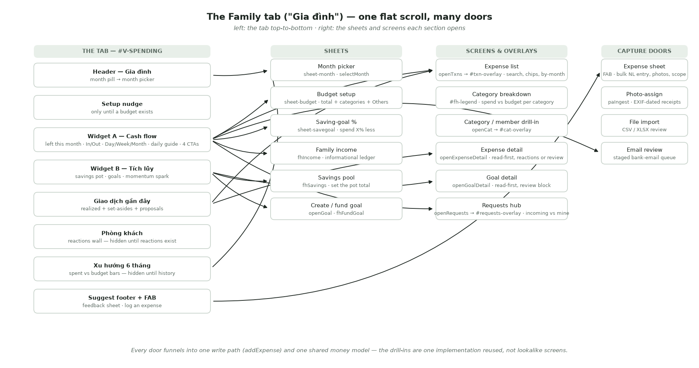
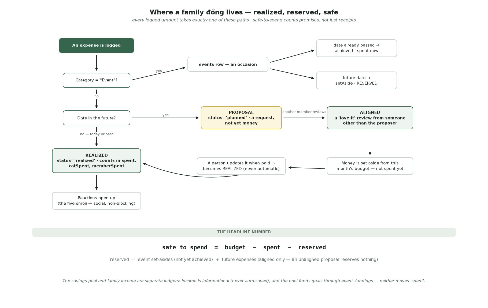
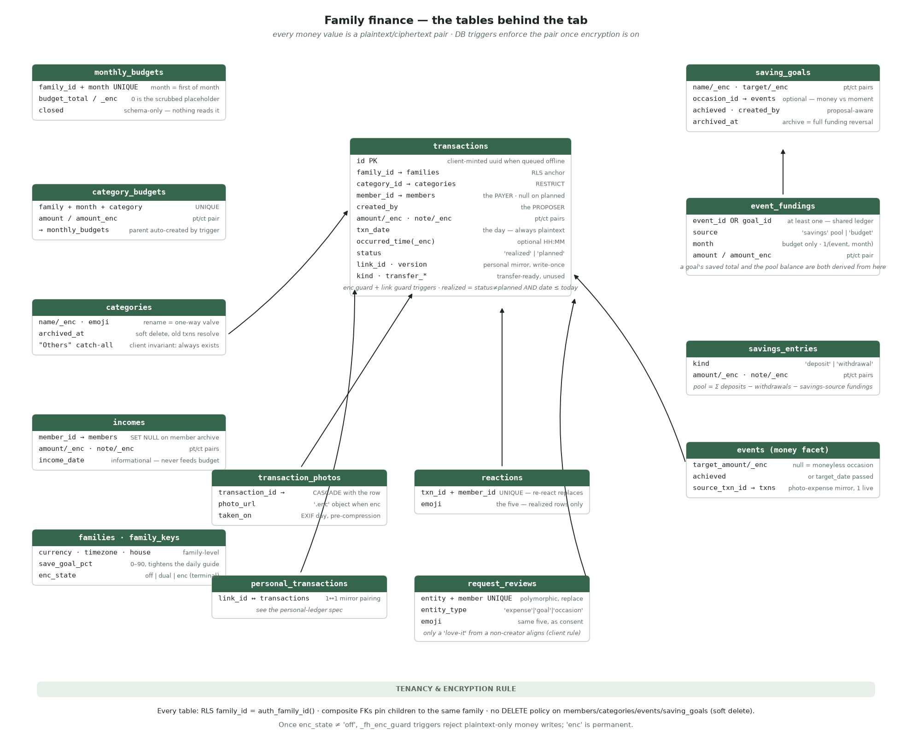
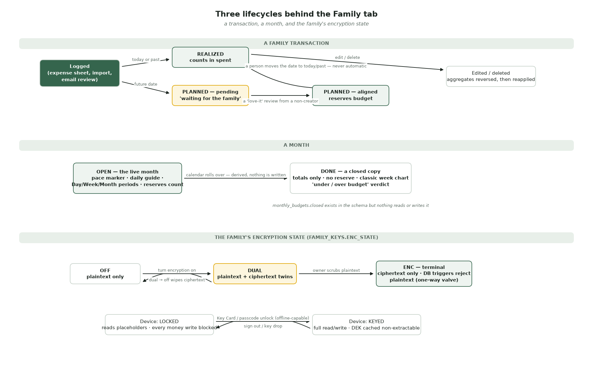
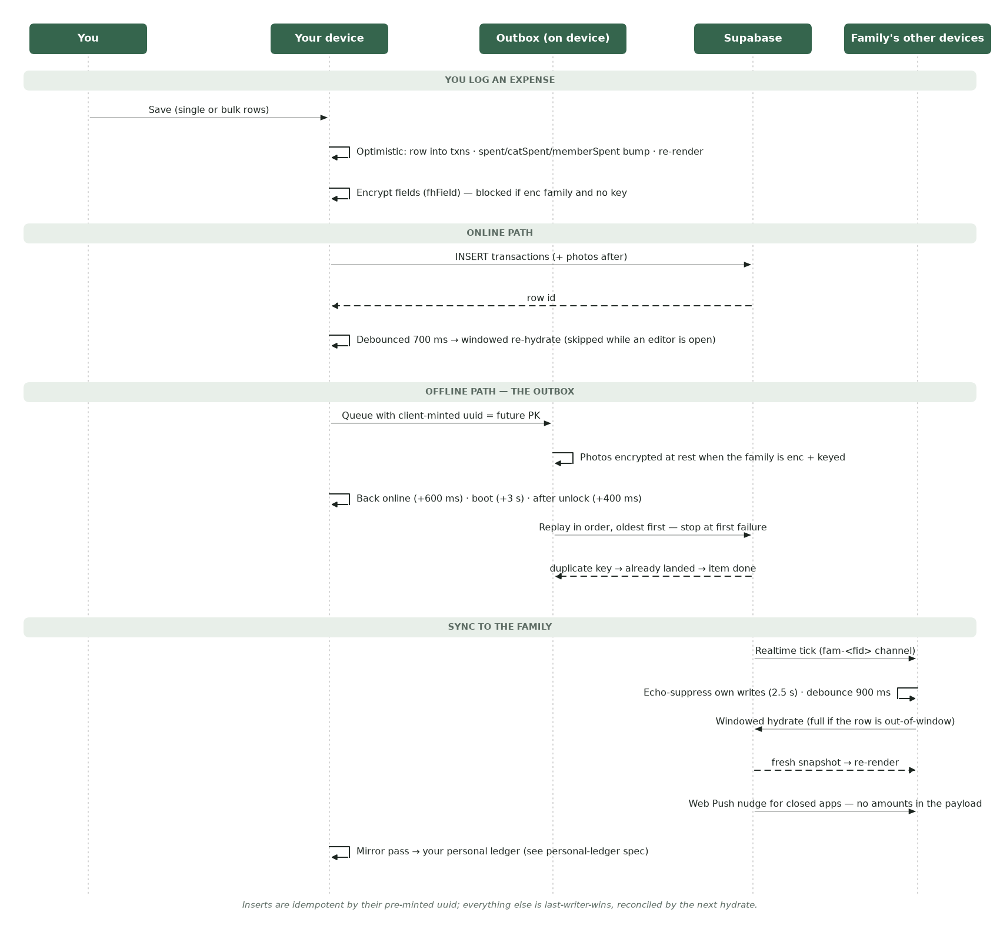

# The Family Tab ("Gia đình") — Shared Family Finance

One place the whole household reads its money: what's left this month, what's
already promised, what everyone thinks about it — and one place every đồng
enters the shared ledger. The tab the app labels **Gia đình** (internally
`spending`, view `#v-spending`) is FamilyHub's financial center of gravity:
every other money feature is either a widget on this scroll or a door opened
from it.

> **Status, 2026-08-29.** Live in production. The cash-flow card with the
> three-period chart and self-correcting daily guide, budget + categories with
> the "Others" catch-all, saving goals and the savings pool, the proposal /
> alignment flow, reactions, the expense capture sheet (bulk natural-language
> entry, photos, per-row time), file import, bank-email review routing, offline
> outbox, realtime sync, and family E2EE are all shipped. This is the first
> written spec for the tab — reconstructed from the live code, schema, and
> feature docs, not a forward-looking design.

> **Audience & layering.** Part 1 (Behaviour) is for everyone — product,
> design, QA, onboarding. Part 2 (Technical Appendix) is for engineers. The
> five diagrams are the zoom-out views; the
> [Family vs Personal](#8-family-vs-personal-at-a-glance) table is the
> one-glance boundary with the sibling
> [personal-ledger spec](personal-ledger-spec.md).

---

# Part 1 — Behaviour

## 1. Summary

- The Family tab is the household's **shared** money book: spending, income,
  budget, savings and goals that every keyed family member can read and write.
  It answers one question in passing — *can we still spend?* — and it answers
  it honestly, counting not just receipts but promises.
- The headline arithmetic is `safe to spend = budget − spent − reserved`.
  **Reserved** is money the family has committed but not yet paid: event
  set-asides, plus future expenses — and a future expense someone typed in
  counts only after another member has agreed to it.
- Money enters through many doors — typing (single or bulk), receipt photos,
  file import, bank email — but every door funnels into **one write path**,
  one review vocabulary, and one ledger.
- The social layer is deliberately split in two: **reactions** (five emoji,
  free-form, on money already spent) and **reviews** (the same five emoji
  re-labelled as consent, on money not yet spent). Only one specific signal —
  a 🥰 from someone other than the proposer — changes what the money does.
- Everything on the tab is protected by the family's end-to-end encryption
  once it is turned on: amounts, notes, names, and photos are ciphertext to
  the database and to FamilyHub the operator. A locked device can look
  (placeholders), but cannot write.

## 2. Why this exists

- **Budget-vs-actual is the wrong question.** A family that has spent 40% of
  its budget on day 10 is ahead of pace; the same 40% on day 25 is comfortably
  under. The tab is built around pace and headroom — the run-rate marker, the
  per-day guide, the week/month comparisons — so "can we spend?" is answered
  without anyone doing math.
- **Committed money must count before it is spent.** An event the family is
  funding, or a couch one partner plans to buy next week, is not free money.
  If "safe to spend" ignored promises, the number would flatter the family
  into overspending. The reserve concept exists to make the headline number
  the *real* number.
- **Shared money needs consent, lightly.** A future expense typed by one
  member should not unilaterally claim family budget. The proposal flow is
  deliberately not an approval workflow — it is a single "yes, count me in"
  from any other member, expressed with an emoji the family already uses.
- **Logging must be effortless or it stops.** Bulk comma entry with Vietnamese
  amount shorthand ("cafe 50k, chợ 200k"), guessed categories, drafts that
  survive an accidental swipe, photos, imports, and bank email all exist to
  keep the ledger alive past week three.

## 3. What you see — a tour of the tab

The tab is **one flat scroll** — the old overview / breakdown / activity
segments are now just scroll anchors. Top to bottom:

### 3.1 Header and month picker

Title **"Gia đình"**, subtitle "Chi tiêu, thu nhập và tiết kiệm của cả nhà."
("The family's spending, income and savings.") A month pill opens the month
picker: one row per month the ledger knows, each with `spent trên budget` and
a verdict — a closed month reads "dưới ngân sách / vượt ngân sách" (under /
over budget), the live month "đang diễn ra" (in progress). Picking a month
re-renders the whole tab in that month's context.

### 3.2 First-run nudge

Until a monthly budget exists, a single card sits on top: "Lập ngân sách cho
cả nhà" ("Set up your budget") — and removes itself the moment one is saved.

### 3.3 Widget A — the cash-flow card

The focal card. **"Còn lại tháng này"** ("Left this month") = income − spent,
red when negative. Two tiles: **↑ Thu** (tap → the family income sheet) and
**↓ Chi** (tap → glide to the transaction list).

Below the number, a swipeable chart with three periods on the live month —
**Day · Week · Month** — sharing one bar language: faint bars are the previous
comparable period, solid bars are now, and a bar turns warning-colored when it
beats its faint twin.

- **Day** buckets today by buổi — Sáng · Trưa · Chiều · Tối — against
  yesterday. A transaction's hour comes from when it was logged; unknown hours
  land in the current buổi.
- **Week** runs Mon→Sun against the same days last week.
- **Month** compares four fixed week-buckets against last month's.
- The three views auto-rotate every few seconds when the card is visible
  (never under reduced motion); any touch pauses them, and a manual pick is
  remembered on the device. A **past month** shows the classic week chart plus
  a week-over-week note ("▼ Giảm … so với cùng kỳ tuần trước") instead of
  periods.

**The daily guide** ("Hôm nay còn tiêu được" / "Left to spend today") appears
once there is any basis for one, as a tinted tile with a water-level circle.
It is **self-correcting**: the allowance is what's left of the month's budget
spread over the days left, sliced to the period — so once the month's budget
is blown, Day, Week and Month all read "over" together; a good Tuesday can
never say "keep spending" while the month is failing. The allowance is capped
by last month's daily pace (the saver of the two signals) and tightened by the
family's saving goal. Colour tells the trend: green/yellow/orange headroom
under plan; over plan but spending *less* than the previous period stays
orange (improving); over both goes red. Tapping the tile opens the
**saving-goal sheet**: "Tiêu hoang như trước" (0%) or "Tiêu ít hơn
10/15/20/50%", each with an estimated monthly saving; a tap applies instantly,
family-wide.

The card ends with up to four full-width action rows: **Lập ngân sách** (set
up budget), **Xem chi tiêu** (view expenses), **Đề xuất chi tiêu** (expense
proposals — only when some are open, badged with the count), and **Khoản thu
chi từ email** (the bank-email door — always present, badged when captured
transactions are waiting for review).

### 3.4 Widget B — Tích lũy (savings)

The savings card: pot total = money already in goals plus the free pool. A
sub-label reads "Cần thêm …" (to go), flips to "… sắp đến hạn" when goals are
due within 30 days and short, or "Hoàn tất" when nothing is left to save. Goal
rows show emoji, name, `saved / target`, an "quá hạn" (overdue) tag when
past-date and unfunded, and a slim meter. Completed goals fold into one
expandable row. When the family saved more this month, a momentum spark says
so ("Tháng này để dành thêm …"). The ＋ button creates a goal; the total opens
the pool sheet. With no goals yet, the card carries its own CTA: "Tạo mục
tiêu đầu tiên."

### 3.5 Giao dịch gần đây — the activity feed

One card, one timeline. Future money first — event set-asides and future
expenses, farthest due date first, each labelled with who proposed it and
where it stands ("chờ sếp duyệt" / "sếp duyệt rồi") — then realized spending
from **today and yesterday only**; the full history lives behind "Xem tất cả".
The header flips from "Giao dịch gần đây" to "Hoạt động" whenever future rows
exist. Rows carry the category emoji (or the receipt photo as the tile), the
payer's avatar, note, date + optional clock time, amount, and any reactions.
A brand-new family sees a first-run card: "Ghi khoản chi đầu tiên."

### 3.6 Phòng khách — the reactions wall

"Hoạt động gia đình": a horizontal rail of poster cards, one per reacted-to
transaction — the photo (or a gradient), the lead emoji, a deterministic
one-liner ("Hân đang xỉu ngang vụ này"), note · amount · age. Hidden entirely
until the family has reacted to something. Tapping a card jumps to that
expense.

### 3.7 Xu hướng 6 tháng — the trend

One bar per known month, spent vs a dashed budget line, current and
over-budget months styled distinctly. Hidden until some month has real
spending ("an all-flat trend reads as broken, not empty"). Tapping a column
selects that month everywhere.

### 3.8 The FAB and the suggest footer

The floating ＋ is the family quick-add: a sheet with **Ghi giao dịch**,
**Nhập từ file**, **Ghi thu nhập**, **Bỏ ống tiết kiệm**, **Tạo mục tiêu**,
plus the Moments group. The footer is a feedback door ("Có ý tưởng hay muốn
góp ý? Kể tụi mình nghe nha 💛").

## 4. The money model — spent, reserved, safe

Every logged amount takes exactly one of three paths:

1. **Realized** — dated today or earlier. It counts into the month's `spent`,
   the category's total, and the payer's total, immediately and optimistically
   on the device that logged it.
2. **A proposal** — dated in the future. It is a request, not money: it
   reserves **nothing** until some other family member reviews it with 🥰.
   Once aligned, its amount joins the month's reserve. When the money is
   actually paid, a person updates the row (moves the date to today) — a
   proposal never silently becomes spending on its own.
3. **An event** — the special "Event" category doesn't create a transaction at
   all; it creates an occasion. Past-dated: achieved, spent now, photos become
   memories. Future-dated: its amount becomes a set-aside — reserved, not
   spent.

The headline number the family sees everywhere —

> **safe to spend = budget − spent − reserved**
> reserved = event set-asides (not yet achieved) + aligned future expenses

Two adjacent ledgers deliberately do **not** move `spent`: family **income**
is informational ("ghi riêng, không tự động để dành" — tracked on its own,
never auto-saved), and the **savings pool** funds goals through its own
contribution ledger.

## 5. Where family transactions come from — the doors

### 5.1 Typing — single or in bulk

The expense sheet opens from the FAB (scoped 🏡 Gia đình / 🔒 Cá nhân — the
family side of the chips; the personal side is the sibling spec's story). It
behaves like a running list: type `"cafe 50k, chợ 200k, đi chơi 800k"` and
each comma-terminated segment peels into its own card with amount and category
already guessed. Amount parsing speaks Vietnamese shorthand — `50k`, `1tr2`,
`2 tỷ`, and a bare "45" under VND means 45.000₫. Category guessing is
two-axis: language-aware keywords ("gas" is Transport in English, cooking gas
→ Housing in Vietnamese) resolve to a *concept*, and the concept then searches
the family's **own** categories by name or emoji — the guesser never invents a
category the family doesn't have, and never overwrites a hand-picked one.
Each row carries its own optional clock time: a same-day row defaults to now,
a back-dated row stays day-only — the app never fabricates a time it doesn't
know.

Half-typed batches survive anything: every keystroke mirrors the draft to the
device (encrypted, for an encrypted family), an accidental swipe-down keeps
it, and reopening restores it with "Đã khôi phục bản nháp chưa lưu."
Discarding is a deliberate two-tap.

### 5.2 Receipt photos

An expense can carry up to 10 photos, which double as memories. Photos are
always re-encoded before upload — stripping EXIF and GPS — but the capture
*date* is read from the original file first, because it powers the
**photo-assign** tool: dump up to 20 receipt photos, and the tool groups them
by the day they were taken next to that day's expenses. It narrows; it never
auto-assigns — the final match is always a human tap. A day with photos but no
expense offers to log one, pre-filled with the date and the photos.

### 5.3 File import (CSV / XLSX)

"Nhập từ file" accepts bank and budgeting-app exports (Vietcombank, MB Bank,
Money Lover, Misa; password-protected Excel included). Columns are mapped by
heuristics first; only a genuinely ambiguous file sends a **masked** sample to
the mapping model — an encrypted family's real amounts and notes never leave
the device readable. Every row lands in a review screen — duplicates flagged,
categories guessed from merchants, MCC codes, and the family's own history,
with on-device learning of corrections — and nothing writes until the person
taps Import. Promotion reuses the exact bulk-expense write path. Import is
expense-only for now; income and transfer rows are set aside and say so.

### 5.4 Bank email

The "Khoản thu chi từ email" row is the bank-email pipeline's family-side
door — capture and review are specified in their own documents
([bank-email-capture-spec](bank-email-capture-spec.docx),
[transaction-review-spec](transaction-review-spec.md)). From this tab's point
of view: captured transactions accumulate in a sealed queue, the CTA badge
counts them, and the review screen (the same engine as file import) promotes
approved rows through the same one write path, with a per-row choice of the
family or personal ledger.

### 5.5 Income

The **Thu** tile records family income: amount, optional note, day. It is a
deliberately separate, informational ledger — the sheet itself says money in
is "không tự động để dành" (never auto-saved). Moving money into savings is
its own explicit act.

## 6. The social layer — reactions vs proposals

Both features use the same five emoji — 😱 🤨 😂 🥰 😤 — and they are two
different systems, split by time:

- **Reactions** apply only to money already spent. Long-press any ledger row,
  pick an emoji, and it appears as an inline chip, on the Phòng khách wall,
  and as a confetti "arrival" moment on the rest of the family's devices. One
  reaction per person per transaction; re-reacting replaces; tapping your own
  again clears it. Reactions never change what a transaction is.
- **Reviews** apply only to money not yet spent — future expenses, saving
  goals, future occasions. The same five emoji are re-labelled as decisions
  ("Đồng ý — chốt luôn" · "Bàn thêm chút nha" · "Chưa hợp lúc này"), and
  exactly one signal has consequences: **a 🥰 from someone other than the
  proposer aligns the proposal**, which is what lets it reserve money. The
  proposer can never approve their own request — they see a read-only
  "waiting / aligned" view.

The requests hub (behind Widget A's badged CTA) splits everything into two
lanes: "Chờ bạn duyệt" (waiting for you) and "Yêu cầu của bạn" (yours,
waiting on others). New requests and decisions arrive as gentle confetti
moments, each with its own seen-watermark, and a decision notifies only the
person who asked.

## 7. Budget and categories

The budget sheet holds the monthly total and the category list. Three rules
keep it honest:

- **"Others" is an invariant, not a category.** It always exists, cannot be
  renamed or removed, and its amount is never typed — it is always
  `total − everything named`, floored at zero. Rename or delete any category
  and the arithmetic self-corrects; money can never fall between categories.
  If the named categories over-allocate, the sheet says by how much.
- **Auto-split never overwrites a human.** Entering a monthly total fills
  untouched categories using best-practice weights (housing .32, groceries
  .20, transport .15, dining .13, …); any row you've edited by hand is left
  exactly as it is.
- **Renames cascade; deletes archive.** Renaming a category rewrites every
  transaction and every month's totals; deleting one archives it server-side
  (old transactions keep resolving) — after a two-tap arm-then-confirm.

Each category row on the breakdown shows spend vs budget with an over-budget
signal; the drill-in adds pace: "Vượt ngân sách" · "Đang tiêu nhanh hơn dự
kiến" · "Thoải mái dưới mức" · "Đúng nhịp".

## 8. Goals and the savings pool

A **goal** is money toward a thing ("New laptop", target, optional date); an
**occasion** is a moment. They are separate objects, optionally linked — so a
goal can back a trip the family is also planning, and a free picnic never
needs a fake target amount.

- The **pool** is topped up explicitly ("Bỏ ống tiết kiệm" — the sheet sets
  the total, it doesn't add). Goals are funded from the pool; the client
  refuses to fund past what the pool holds.
- A goal is **done when fully funded** — a passed date makes it *overdue*,
  never quietly done.
- A new goal is a **proposal** (it carries its creator), so it enters the same
  review flow as a future expense.
- **Deleting a goal is a full reversal**, and the confirm sheet says exactly
  that: pool-sourced money returns to the pool, budget-sourced money comes
  back off that month's spend. Nothing is stranded.

## 9. Months and history

Months are derived, not managed: the first hydrate of a new calendar month
simply starts a new bucket, and older months read as closed — no one "closes
the books". A closed month keeps its totals and verdict but doesn't itemize
transactions ("Các tháng trước chỉ hiển thị tổng"), holds no reserve, and its
budget doesn't carry forward — a new month's budget exists when someone saves
one. The 6-month trend and the month picker read from the same derived model.

## 10. Privacy and trust

- **Family E2EE, once on, is real and one-way.** Amounts, notes, category and
  member names, goal targets, captions and photo bytes are ciphertext under
  the family key; the database enforces this with triggers, not policy — a
  plaintext money write is *rejected* once encryption is on, and the final
  `enc` state is permanent.
- **A locked device fails safe.** It shows placeholders ("•••", zeros) rather
  than wrong numbers, blocks every money write with an unlock prompt, and even
  the offline queue refuses to replay until the key returns.
- **Drafts and imports respect the same promise.** Expense and import drafts
  are encrypted on disk for an encrypted family; import samples are masked
  before any network call; receipt photos are stripped of EXIF/GPS and stored
  as encrypted objects.
- **Notifications carry nothing.** Pushes say something happened — never an
  amount or a merchant.
- **What is not hidden:** transaction dates (`txn_date`) and category emoji
  stay plaintext by design — they drive month math and indexing without
  exposing values.

## 11. Family vs Personal at a glance

| Aspect | Family tab (this spec) | Cá nhân tab |
|---|---|---|
| Who reads it | Every keyed family member | Only you |
| Key | Family Key Card / passcode, shared, socially recoverable | Personal Key Card, no escrow |
| Tables | `transactions`, `incomes`, `saving_goals`, … | `personal_*` twins |
| Encryption | `off → dual → enc` lifecycle, DB-enforced | Ciphertext-only from birth |
| Categories | Family table, "Others" invariant, renames cascade | Denormalised on each row |
| Social layer | Reactions + proposals/reviews | None |
| Photos | Yes (encrypted objects) | Not wired yet |
| Your authored family expenses | Live here | Mirrored in, read-only, via `link_id` |
| Offline writes | Outbox with pre-minted ids | Direct writes |

## 12. Safety rules

- **Nothing reserves without consent.** An unaligned proposal reserves zero.
- **Nothing realizes automatically.** A planned expense becomes spending only
  when a person updates it.
- **Unreadable is never zero pretending to be fine.** A locked or key-less
  device sees placeholders and a persistent unlock bar, not silently
  understated totals.
- **Edits reverse before they reapply.** Changing an expense's amount,
  category or payer backs the old contribution out of the month's totals
  before adding the new one — no double counting.
- **Deletes are honest.** Goal/event deletion names its consequence (money
  returns to the pool / comes off the month) and requires arm-then-confirm;
  so do category rows, income rows, drafts, and photo batches.
- **Offline writes cannot duplicate.** A queued expense carries its future
  database id; replaying twice is a no-op.
- **The guesser never invents.** Category guessing maps to the family's own
  categories or leaves the row unclassified.

## 13. Status and current limits

- **Live:** everything in Part 1.
- **Structural limits:**
  - Month buckets are keyed by month name without the year — a ledger longer
    than 12 months folds e.g. Aug 2025 into Aug 2026. The trend and history
    features must fix this before multi-year families.
  - Clock times are stored as bare local `HH:MM` on the deliberate
    single-timezone (VN) assumption — upgrade to offset-bearing instants
    before any non-VN user or source (see `docs/features/transaction-time.md`,
    the tripwire).
  - Offline queueing covers **inserts only**; offline edits/deletes fail with
    a toast. Reactions are deliberately not queued.
- **Not built / dormant:**
  - Transfers between accounts: schema-ready (`kind`, `transfer_id`), no
    writer.
  - USD: render-only fallback for a few legacy families; nothing offers or
    writes it.
  - File import of income/transfer rows (deferred rows say so in review).
  - A dormant render path (`renderCatBudget`, `renderMembers`, the old hero
    ids) writes to DOM ids that no longer exist — safe no-ops, prune
    candidates; the category breakdown lives in the expense-list overlay now.
  - The suggest sheet is toast-only (no network write yet).

---

# Part 2 — Technical Appendix

## 14. Architecture in one view

One RPC hydrates everything; one in-memory model renders everything; every
write is optimistic-then-persisted; realtime nudges other devices to
re-hydrate; encryption sits under all of it as the shape of every read and
write. There is no per-feature fetch and no server-side month math the client
depends on — an encrypted family's amounts are invisible to SQL, so the
client *is* the calculator.

**Module map.**

| File | Owns |
|---|---|
| `src/js-ui/10-nav-model.js` | Tab routing, month model `months`/`M()`, reserve math (`monthReserved`, `_entAlignedBy`), currency/format, trend |
| `src/js-ui/20-budget.js` | `renderBudget`/`renderCashflow` fan-out, the three-period chart, daily guide (`cfPerDay`, `fhGuideCompute`), budget sheet, "Others" invariant, CTAs |
| `src/js-ui/60-transactions.js` | `txns` ledger, `addExpense()` (the single write path), tab feed, full list overlay, `openCat` drill-in |
| `src/js-ui/61-expense-detail.js` | Read-first expense detail; reactions block vs review block |
| `src/js-ui/50-sheets-expense-capture.js` | Expense sheet: bulk rows, NL parsing, drafts, EXIF, sheet plumbing (`openSheet`) |
| `src/js-ui/55-expense-photos-writes.js` | Photo cap/upload, `saveExpenseEdit`/`deleteExpense` (reversal math), photo-assign, `submitExpense` router |
| `src/js-ui/35-goals.js` · `36-goal-detail.js` | Tích lũy card, goal create/fund, read-first goal detail |
| `src/js-ui/62-reactions.js` · `64-requests.js` | Reactions (chip, wall, arrivals) · Requests (hub, review sheet, watermarks) |
| `src/js-data/70-goals-income-onboard-ui.js` | Goal/income/savings persistence (`fhCreateGoal`, `fhFundGoal`, `fhSavings`, `fhAddFamilyIncome`) |
| `src/js-data/30-hydrate.js` | `loadFamilyData()` — snapshot RPC, decrypt-in-place, month/ledger/goal/reaction model build |
| `src/js-data/20-data-helpers.js` | `DB` maps, `_syncSoon` debounce, `_w` error surfacing |
| `src/js-data/40-txn-writes-outbox.js` | `_dbInsertTxn/_dbUpdateTxn/_dbDeleteTxn`, photo upload/encrypt, the offline outbox |
| `src/js-data/50-writethrough-realtime.js` | Write-through wrappers, budget save, reactions/reviews upserts, realtime channel |
| `src/js-data/15-crypto.js` | `fhField`/`fhRead`, DEK cache, enc-state machine |
| `src/js-data/68-lock-wall.js` · `65-passcode-ui.js` | Lock wall, unlock, `fhAfterUnlock` |
| `src/js-ui/56-csv-import-ui.js` · `57-csv-import-review.js` | File-import review engine (shared with bank-email staged review) |

## 15. Schema reference

Source of truth: `supabase/migrations/0001–0099`. Conventions: every table
carries `family_id`; RLS predicate `family_id = (SELECT auth_family_id())`
(0004, initplan-wrapped 0022); composite FKs `(id, family_id)` pin children to
the tenant; money is `numeric(14,2)` in the family currency; every protected
value is a plaintext/ciphertext pair (`X` + `X_enc`, 0030), enforced by
`_fh_enc_guard` triggers (0033) once `enc_state ≠ 'off'`; soft-deleted tables
(`members`, `categories`, `events`, `saving_goals`) have `archived_at` and no
DELETE policy.

### `transactions` (0001; +0024 `created_by`, 0030 enc, 0076 link/kind, 0096 time)

| Column | Notes |
|---|---|
| `id` uuid PK | client-minted when queued offline — the idempotency key |
| `family_id` → families | RLS anchor |
| `category_id` → categories | composite FK, RESTRICT — categories archive, never orphan |
| `member_id` → members | the **payer**; nullable; CHECK `status='planned' OR member_id IS NOT NULL` |
| `created_by` | the **proposer** (0024) — a different question from the payer |
| `amount`/`amount_enc` · `note`/`note_enc` | pt/ct pairs; presence CHECK one of each pair |
| `txn_date` date | the day — always plaintext (month math, windowing) |
| `occurred_time`/`occurred_time_enc` | optional local `"HH:MM"` (0096); null = day-only. **Not yet in the enc-guard pair list or the snapshot** |
| `status` | enum `realized` \| `planned` |
| `link_id` · `version` | personal-mirror pairing; write-once / monotonic (`_fh_link_guard`, 0076) |
| `kind` · `transfer_id` · `transfer_dir` · `space_id` | transfer plumbing + Model-X remnant — schema-ready, unused |

Indexes: `(family_id, txn_date)`, `(category_id, family_id)`,
`(member_id, family_id)`, partial on `link_id`/`space_id`. Client-side rule:
`realized = status ≠ 'planned' AND txn_date ≤ today` — a planned row never
self-realizes.

**`transaction_photos`** (0001; `taken_on` 0018; photo guard 0039):
`transaction_id` composite-FK CASCADE, `photo_url` (must be null / absolute /
`%.enc` once enc), `sort_order`, `taken_on` (EXIF day).

### Budget tables (0001; enc 0030/0033)

- **`monthly_budgets`** — `(family_id, month)` unique, month CHECKed to the
  1st. `budget_total` stays NOT NULL through E2EE — **0 is the scrubbed
  placeholder** (readers prefer `budget_total_enc`). `closed boolean` exists
  and is echoed in the snapshot but **nothing reads or writes it** — month
  closure is derived client-side.
- **`category_budgets`** — `(family_id, month, category_id)` unique;
  `amount`/`amount_enc`; FK RESTRICT to both parents; BEFORE-INSERT trigger
  auto-creates the parent `monthly_budgets` row. Budget writes are plain
  PostgREST table writes — there is no budget RPC.

### `categories` (0001; enc 0038; roster 0055)

`name`/`name_enc`, `emoji`, `color`, `sort_order`, `archived_at`. The 0038
text guard is a **one-way valve**: inserts pass (server seeds), but an update
that changes `name` must carry fresh `name_enc`, and in `enc` a changed name
may not materialize as plaintext. "Others" is a client invariant
(`CAT_FALLBACK`), not a schema object.

### `incomes` (0010; enc 0030)

`member_id` composite-FK **SET NULL** (unlike transactions' RESTRICT),
`amount`/`_enc`, `note`/`_enc`, `income_date`. Informational — nothing joins
it to budget math.

### Goals & savings (0019 → 0020 → 0021; RPCs 0013/0037; enc 0030/0033)

- **`saving_goals`** (0020) — `name`/`_enc`, `target_amount`/`_enc`,
  `target_date`, `note`/`_enc`, `occasion_id` → events (SET NULL; the *only*
  goal↔occasion link), `achieved`, `created_by` (0024), `archived_at`.
- **`event_fundings`** — the shared contribution ledger: CHECK
  `event_id IS NOT NULL OR goal_id IS NOT NULL` (0021); `source` enum
  `savings` \| `budget`; `month` required iff budget-sourced (first-of-month);
  partial unique `(event_id, month) WHERE source='budget'` — one budget
  reservation per event per month. A goal's `saved` and the pool balance are
  both **derived** from this table, never stored.
- **`savings_entries`** — `kind` `deposit` \| `withdrawal` (sign lives in the
  enum), `amount`/`_enc`, `note`/`_enc`, `entry_date`. Pool = Σ deposits −
  withdrawals − savings-source fundings, floored at 0. The `set_savings` RPC
  (0010) computes the delta in SQL — a **pre-E2EE relic** blocked by the enc
  guard for dual/enc families; the client computes the delta instead.
- **`archive_goal(uuid)`** (0037) / **`archive_event(uuid)`** (0013) —
  SECURITY DEFINER: delete **all** the entity's funding rows (full reversal),
  then soft-archive. Chosen over stranding money in an invisible goal.

### Social tables (0023 / 0024)

- **`reactions`** — `unique (transaction_id, member_id)`; upsert = replace;
  composite FKs CASCADE; plaintext `emoji`. Windowed in the snapshot alongside
  transactions (0048).
- **`request_reviews`** — polymorphic `entity_type` CHECK
  `('expense','goal','occasion')` + `entity_id` (no FK) +
  `unique (entity_type, entity_id, member_id)`. The alignment rule (🥰 from a
  non-creator) is **client-side**; the DB stores any emoji. Never windowed.
  Companion `created_by` columns landed on `transactions`, `saving_goals`,
  `events` in the same migration.

### Context

**`families`**: `currency` (`VND`\|`USD`), `timezone` (drives family-local
"today"), `house` jsonb, `save_goal_pct` smallint 0–90 (0070; written via
`set_family_save_goal`, deliberately not E2EE — a percentage, not money).
**`family_keys`**: `enc_state`, KDF params, `wrapped_dek`, staging keypair
(0051). **`events`** (money facet): `target_amount`/`_enc` nullable (0019),
`achieved` (or date-passed via views), `source_txn_id` → transactions with a
one-live-mirror partial unique (0015/0016). `email_transactions` staging is
service-role-only and reaches this ledger exclusively through the client's
review + `addExpense()` path — see the bank-email and review specs.

### `get_family_snapshot(p_txn_from date)` — the one read

SECURITY DEFINER, returns the whole family in one payload: family, enc recipe,
key wraps, members, categories (archived included), category/monthly budgets,
transactions (windowed by `p_txn_from`, newest first), events, fundings
(always full), savings entries, memories, transaction photos + reactions
(windowed with their transactions, 0048), incomes, goals, request reviews
(always full). Not in the snapshot: `occurred_time`, the 0076 columns,
`save_goal_pct` (separate small read), staging keys (separate RPC). A
pre-migration server returns missing arrays as empty — hydrate survives.

The pre-E2EE reporting views (`v_month_spent`, `v_savings_balance`, …, 0002)
still exist but return NULLs for encrypted families — effectively legacy; the
client computes everything from decrypted snapshot data.

## 16. Encryption for family data

The family construction is the one the personal ledger mirrors one level down
(full detail: `docs/features/encryption.md`; keys:
`docs/features/key-card-auth.md`). What the Family tab depends on:

- **Key hierarchy:** Key Card (600k PBKDF2 iters) or legacy passcode (310k) →
  HKDF → `K_auth` (door proof, bcrypt-stored) / `K_wrap` (device-only) →
  family **DEK** → every value `b64(iv‖AES-256-GCM ct)`. The DEK is cached in
  IndexedDB as a **non-extractable CryptoKey**.
- **States:** `off → dual → enc`, with `enc` **terminal** (0035). In `dual`
  both twins are written and mismatches are logged loudly; the owner's scrub
  (`scrub_plaintext_amounts`) nulls plaintext across all covered tables and
  flips to `enc`. Enforcement is trigger-side: a plaintext-only money write
  is rejected with `enc_required`.
- **The two shapes:** `fhField(name, value)` builds every write
  (enc → ciphertext-only, **throws without the key** — fail-closed);
  `fhRead(row, name)` resolves every read (decrypt failure → null — renders
  as 0/"•••", fail-open for display, flagged by the lock bar).
- **Write lock:** once `enc_state ≠ 'off'`, a keyless device is hard-blocked
  from every money write (`_fhWriteLocked`) with an unlock prompt; reads and
  non-money features stay available ("browse read-only").
- **Lock wall:** raised after a hydrate detects a needed key; offline-capable
  unlock (AES unwrap needs no server); `fhAfterUnlock` flushes the outbox,
  re-hydrates, and schedules the coverage sweep.
- **Photos:** encrypted client-side into `.enc` objects in a public-by-URL
  bucket — privacy from the key, not the address; EXIF/GPS always stripped by
  canvas re-encode; a MutationObserver decrypts into memory-only object URLs
  that die with the key.

## 17. Lifecycle — boot, hydrate, the month model

**Boot.** Warm start restores the last snapshot (localStorage for small
plaintext; IndexedDB, DEK-encrypted, for enc families — plaintext family data
never touches disk) and renders instantly with an "Updating…" chip; then the
real hydrate replaces it. `window.DB` is pre-seeded from the snapshot maps so
writes work before the first hydrate lands.

**Hydrate** (`loadFamilyData`): one `get_family_snapshot` RPC (17-query
fallback for unmigrated envs), decrypt-in-place via `fhRead` per field, then
build the model: `DB.*` maps, `catOrder`/`catStyle`/`catBudget`, `window.txns`
(newest-first view rows), `months`/`monthOrder`/`selMonth`, events + goals
(+ per-entity funding aggregates), `savings`, `monthIncome`, reactions and
review maps. Render tail: `renderAll` → trend/legend/cashflow → subscribe
realtime → arrival checks → personal-ledger boot. Every optional tail step is
individually try/caught — a consent check must never cost a hydrate.

**Windowed refresh (R6).** After the first full hydrate, refreshes fetch only
the last ~3 months of transactions/photos/reactions and merge onto the held
baseline (`DB._rawTx`); a full pass runs at most every 5 minutes or when an
out-of-window row changes. The multi-query fallback is never merged (it
returns the full ledger).

**The month model.** `months` is keyed by month abbreviation with
`{label, done, dim, dom, spent, budget, catSpent, memberSpent, _iso}`;
`done` is **derived** (`_iso < current month` — `monthly_budgets.closed` is
schema-only). Aggregates are recomputed wholesale from realized rows each
hydrate and updated incrementally by `addExpense`/`saveExpenseEdit`/
`deleteExpense` in between — the ledger, not the aggregates, is truth.
**Known constraint:** keys collide across years (Aug 2025 = Aug 2026); fix
before multi-year history.

**Transaction lifecycle.** Insert stamps `status` from the date
(`planned` iff future). Hydrate derives the client's `future` flag as
`NOT (status ≠ 'planned' AND date ≤ today)`. Realization is always a human
edit (date moved to today/past → `status='realized'`, clock cleared on
future-going edits — "a future proposal has no clock").

## 18. Write paths

**`addExpense()`** (`60-transactions.js`) is the single write path — the
sheet, bulk save, file import, and email promotion all funnel into it (bulk
under a `BULK_SAVING` flag that defers the toast/nav tail). Three branches:
Event category → `events` row; future date → proposal (no aggregate touched);
else realized → `spent`/`catSpent`/`memberSpent` updated in place,
synchronously. Persistence is layered on by the write-through wrapper: diff
`txns` for the new row → `_dbInsertTxn` → `fhField` envelope → insert (or
outbox) → photo uploads → debounced re-hydrate (700 ms; skipped while an
editor is open). A new mirror event waits for the transaction's real id
before writing `source_txn_id`.

**Edits and deletes** reverse the old contribution before applying the new
one, then force a **full** hydrate (an edit may touch an out-of-window row).
Delete archives the linked mirror event via RPC first (FK cascade would
strand or RESTRICT), then removes storage files, then the row.

**The outbox** (inserts + photos only, by design): a queued row's
`crypto.randomUUID()` becomes its eventual primary key, so replay is
idempotent — `duplicate key` means "already landed, item done". Replay is
strictly ordered, stops at the first failure, and **holds the queue** rather
than bypass encryption: plaintext rows queued before the key raced away are
re-encrypted at flush, and no key → no flush. Triggers: back-online (+600 ms),
boot (+3 s), after unlock (+400 ms). The service worker won't auto-update
while the outbox is non-empty. Offline edits/deletes and reactions are
deliberately not queued.

**Other writers.** Budget save applies queued renames, archives deletions,
upserts `monthly_budgets` (plaintext `budget_total: 0` beside ciphertext —
the NOT NULL placeholder) then per-category rows (0 → delete). Goals/income/
savings write via `fhField` and re-hydrate directly. Reactions and reviews
are optimistic local + upsert-on-conflict (replace-not-stack); a reaction on
an out-of-window transaction escalates to a full hydrate so the windowed
merge can't drop it.

**Errors.** Every write routes through `_w()` because supabase-js *resolves*
4xx instead of throwing; `enc_required` self-heals via `_fhEncRecover`
(SW-update → rehydrate → unlock prompt); net errors stay silent when the row
is already queued.

## 19. Realtime and push

One channel per family (`fam-<fid>`), authenticated so RLS-gated
`postgres_changes` deliver. Sixteen finance/social tables watched with a
`family_id` filter plus the `families` row and `family_keys` (encryption
turned on propagates instantly). A spouse's write arrives as: tick →
**echo suppression** (ticks within 2.5 s of a local write are the device's
own echo) → 900 ms debounce → windowed hydrate (full if the changed row is
out-of-window; DELETE payloads carry only a PK so they always escalate) —
skipped entirely while an expense editor is open. Foreground/`focus` resumes
trigger a throttled hydrate (iOS PWAs resume without reloading).
`email_transactions` is deliberately not watched (sealed rows; refreshed on
foreground).

Push is a nudge layer, not a data layer: `fhNotify(kind, …)` fans out
`expense_new`/`expense_bulk`/`reaction`/`request_new` family-wide,
`request_response` only to the requester, and the daily-guide state push
(`dgstate`) fires only from the device that just logged the expense, only
when today's state worsened. Payloads never carry amounts or merchants.

## 20. Failure modes

| Scenario | Behaviour |
|---|---|
| Expense logged offline | Optimistic row + outbox with pre-minted uuid PK; toast "Đã lưu trên máy, sẽ đồng bộ khi có mạng"; replay on reconnect/boot/unlock; duplicate-key = already landed |
| Replay hits an error mid-queue | Stop at first failure, keep order, retry on the next trigger — no skipping |
| Key missing on an enc family | Every money write blocked (`fhField` throws / `_fhWriteLocked` toast + unlock prompt); outbox flush holds; reads show placeholders + lock bar |
| `enc_required` rejection from the DB | Row queued, `_fhEncRecover` self-heal (apply waiting SW → rehydrate → unlock prompt) |
| Two devices write at once | Row-level last-writer-wins; next hydrate reconciles; inserts can't collide (uuid PKs) |
| Realtime tick for my own write | Echo-suppressed (2.5 s window) — one reload per write, not two |
| Write/hydrate race with an open editor | `_syncSoon` and realtime both refuse to hydrate while `editingTx` is set — the model is replaced wholesale, so an open editor freezes sync |
| Reaction lands on an out-of-window transaction | Full hydrate forced — a windowed merge would silently drop it |
| Editing an expense's category/amount/payer | Old contribution reversed, new applied — totals never double-count |
| Deleting a photographed expense | Mirror event archived via RPC first, storage objects removed, row deleted (photos cascade) |
| Deleting a goal with money in it | `archive_goal` deletes funding rows: pool money returns, budget money comes off that month; confirm sheet names this before the tap |
| Category renamed | Cascades through `txns[].cat`, every month's `catSpent`, and the DB (`__catRenames`); "Others" recomputes; nothing orphans |
| Category deleted with history | Archived, not deleted; old transactions resolve via `DB.catById`; unknown/archived category on a row → the catch-all, never someone else's category |
| CSV/email row can't be categorized | Held in the amber attention section; never auto-imported |
| Proposal reviewed by its own creator | UI shows read-only FOLLOW view; `submitReview` defensively bails |
| Snapshot RPC missing (unmigrated env) | 17-query fallback; newer arrays default empty; never merged as a window |
| Warm boot before hydrate | Snapshot-seeded `DB` maps let writes resolve members/categories; enc snapshots are DEK-encrypted at rest |

## 21. Security invariants

1. Every finance table: RLS `family_id = auth_family_id()`; composite FKs pin
   children to the tenant; no cross-family read or write path exists.
2. Once `enc_state ≠ 'off'`, plaintext-only money writes are rejected by DB
   triggers on all covered tables; `enc` is permanent (one-way valve); scrub
   refuses while any row is uncovered.
3. `fhField` is fail-closed (no key → throw); `fhRead` is fail-open for
   display only (null → placeholder), never for writes.
4. The outbox never bypasses encryption: flush re-encrypts or halts.
5. Offline inserts are idempotent by pre-minted uuid; `link_id` is write-once
   and `version` monotonic (trigger-enforced) — the personal mirror cannot be
   corrupted from the family side.
6. Soft-deleted entities (`members`, `categories`, `events`, `saving_goals`)
   have no DELETE policy — history stays resolvable forever.
7. Alignment requires an actor other than the creator; the creator's own 🥰
   never aligns; the DB unique key makes reviews replace, never stack.
8. Funding reversal RPCs are SECURITY DEFINER and total: no path strands
   money in an archived goal/event.
9. Photo bytes and drafts are encrypted at rest for enc families; EXIF/GPS is
   always stripped; push payloads never carry values.

## 22. Glossary

**Realized / planned.** The stored status split: money spent vs money
proposed. Client-side "future" = planned or future-dated.
**Reserve / set-aside.** Committed-but-unspent money counted against the
month: event budget-fundings + aligned future expenses.
**Safe to spend.** `budget − spent − reserved` — the headline number.
**Aligned.** A proposal that received 🥰 from a non-creator; only then does
it reserve.
**"Others" catch-all.** The undeletable category whose budget is always the
unallocated remainder — the self-correcting bookkeeping invariant.
**Pool.** The family savings balance, derived from deposits − withdrawals −
savings-source fundings.
**Goal vs occasion.** Money-toward-a-thing vs a moment; optionally linked by
`occasion_id`.
**Outbox.** The IndexedDB queue that holds offline transaction inserts under
their future primary keys.
**Windowed hydrate.** A refresh that refetches only recent months and merges
onto the held baseline.
**Echo suppression.** Ignoring realtime ticks caused by this device's own
write.
**Dual / enc.** The two encrypted family states: twins written both ways vs
ciphertext-only (terminal).
**Mirror row.** The personal-ledger copy of a family expense you authored,
paired by `link_id` — the other spec's object.

## 23. Related documents

- [`personal-ledger-spec.md`](personal-ledger-spec.md) — the Cá nhân tab;
  the mirror's other half.
- [`bank-email-capture-spec.docx`](bank-email-capture-spec.docx) — how bank
  emails become staged transactions.
- [`transaction-review-spec.md`](transaction-review-spec.md) — the review
  screen where staged rows (email and file alike) become ledger rows.
- `docs/features/` — design rationale per subsystem: `budget.md`,
  `transactions.md`, `expense-capture.md`, `goals.md`,
  `social-alignment.md`, `csv-import.md`, `transaction-time.md`,
  `encryption.md`, `finance-tab-widgets.md`.
- `docs/ARCHITECTURE.md` — the cross-feature zoom-out (hydrate/write-through
  pattern, entity-review pattern).
- Key migrations: `0001` (core schema), `0002` (views, legacy), `0010`
  (income/savings), `0013`/`0037` (funding-reversal archives), `0015`–`0021`
  (mirror events, goal/occasion split), `0022` (snapshot RPC), `0023`/`0024`
  (reactions, requests), `0030`–`0043` (E2EE), `0048` (windowing), `0055`
  (category roster), `0069`/`0070` (snapshot, save-goal), `0076`/`0079`
  (link/mirror, Model Y), `0096` (transaction time).
