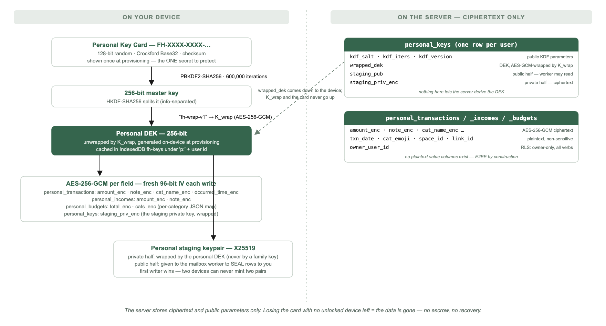
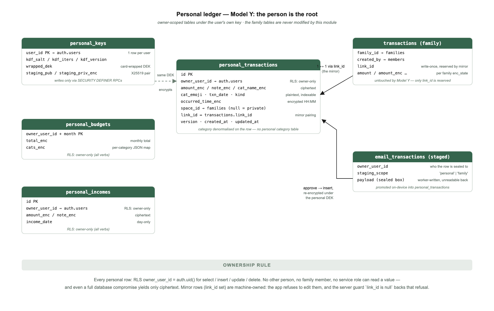
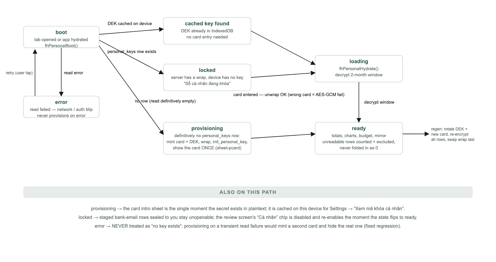
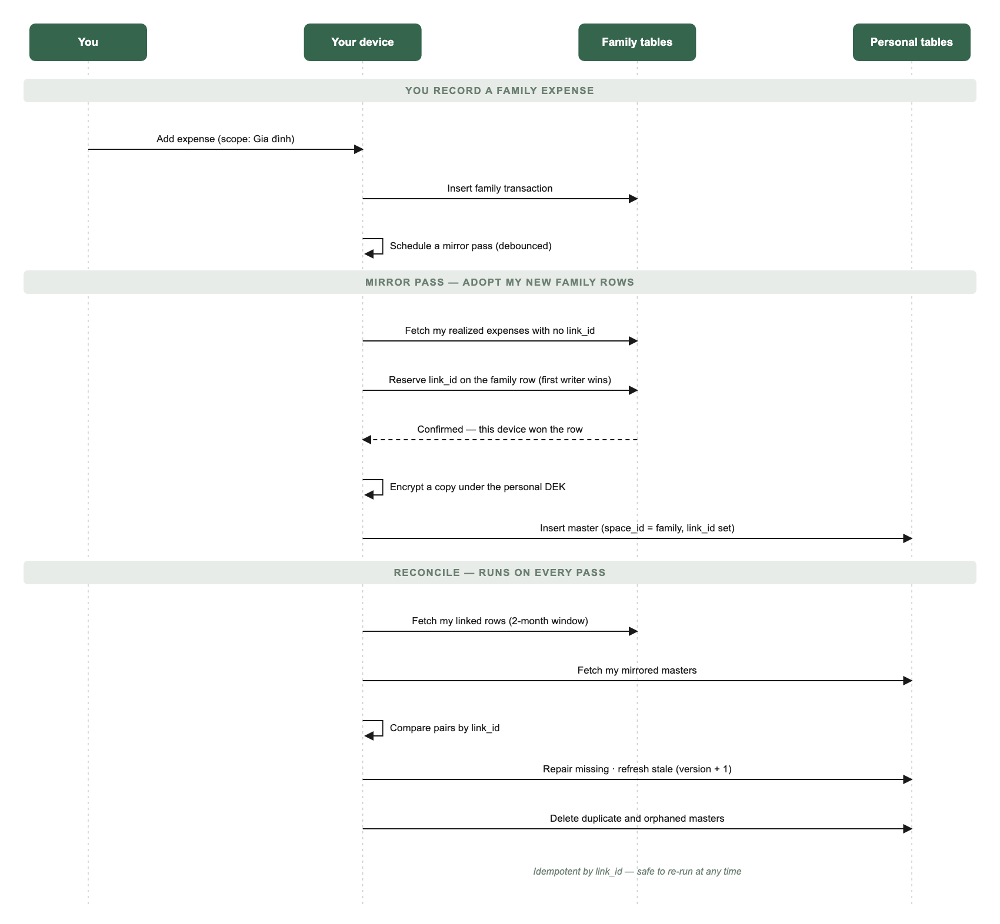

# Personal Ledger & the "Cá nhân" Tab

Your own money book inside a family app. Every member of FamilyHub gets a
private ledger — the **Cá nhân** tab — that the rest of the household cannot
see, encrypted under a key only that person holds. Family spending you author
flows into it automatically; private spending never leaves it.

> **Status, 2026-08-29.** Live in production. Provisioning, key card unlock,
> the full tab UI, the family→personal mirror, scope-picked capture, personal
> budgets (total + per-category), personal incomes, sealed bank-email routing
> into the personal ledger, and card regeneration are all shipped. This is the
> first written spec for the feature — reconstructed from the live code and
> schema, not a forward-looking design.

> **Audience & layering.** Part 1 (Behaviour) is for everyone — product,
> design, QA, onboarding. Part 2 (Technical Appendix) is for engineers.
> The [Family vs Personal](#7-family-vs-personal-at-a-glance) table is the
> one-glance summary; the five diagrams are the zoom-out views.

---

# Part 1 — Behaviour

## 1. Summary

- Every user has a personal ledger: their own transactions, incomes and
  budgets, stored in their own tables and encrypted with a key only they hold.
  The family cannot open it. FamilyHub (the operator) cannot open it either.
- The **person is the root**. A family is just a *space* the person directs
  money to. A family expense you record shows up in your personal book
  automatically (the *mirror*); a private expense stays private forever.
- The ledger is protected by a **Personal Key Card** — a second key card,
  separate from the family's. It is shown once, and it is the only way into
  the data. Lose the card with no unlocked device left, and the data is gone;
  nobody can recover it, including us. That is the promise working as designed.

## 2. Why this exists

- Family finance is a subset of each member's personal finance. A person who
  tracks spending needs the complete picture — what went to the household
  *and* what stayed private — in one place that survives anything that happens
  to the family space.
- Earlier, "personal" was modelled as a special family (internally *Model X*).
  It leaked into family metrics and pickers and made recovery depend on shared
  keys. The current design (*Model Y*) gives the person their own tables and
  their own key: personal stats rebuild from the personal key alone.
- Privacy inside the household is the point, not an accident. Money a person
  spends on themselves — a gift for a partner, a private saving habit — is
  theirs to share or not. The subtitle on the tab says exactly that:
  "Sổ riêng của bạn. Gia đình không xem được."

## 3. What you see — a tour of the tab

### 3.1 The cash-flow card

The tab opens on a focal card, the same visual system as the family Finance
tab, so the two read as siblings:

- **"Còn lại tháng này · cá nhân"** — income minus spending this month, in
  red when negative.
- **Vào / Ra tiles** — tap *Vào* to open your personal income sheet; tap *Ra*
  to jump to the transaction list below.
- A **swipeable Day / Week / Month chart** compares this period against the
  previous one. Day view buckets by time of day (Sáng · Trưa · Chiều · Tối),
  week view runs Mon→Sun against last week, month view compares four weeks
  against last month. Your last-viewed period is remembered on the device.
- A **daily spending guide** ("còn tiêu được…") appears once a personal budget
  exists. It is self-correcting: overspending earlier in the month shrinks
  what Day and Week say you have left, so a blown month reads as blown
  everywhere — no false "you're fine today" while the month is failing.
- Four action rows: **Ngân sách cá nhân** (set or view budget), **Xem chi
  tiêu** (category breakdown), **Ghi giao dịch** (add a transaction), and
  **Khoản thu chi từ email** — the bank-email door, with a badge showing how
  many captured transactions are waiting for review.
- While your authored family expenses are still syncing in, the card says so:
  "Đang đồng bộ các khoản bạn đã ghi cho gia đình…".

### 3.2 Các nhóm của tôi — where your money went

A per-space roll-up of this month: one row per family you spent into ("Bạn đã
chi cho nhóm tháng này") and, if any, a **Riêng tư** row — money only you can
see ("Chỉ mình bạn thấy").

### 3.3 Chi theo danh mục — categories against your budget

Spend by category, largest first. With a budget set, a progress bar shows
spent vs budget and flips to the danger colour when over ("vượt …"); category
bars are then scaled against the budget rather than against each other.
Personal budgets support a monthly total and per-category amounts, using the
same budget sheet as the family tab, opened in personal scope.

### 3.4 Giao dịch của bạn — the transaction list

The latest transactions (30 on the tab; the full list opens via *Xem chi
tiêu*). Each row shows the category emoji, note, date — plus a clock time when
one is known — and where it went: a family name, or "riêng tư".

Two row types matter:

- **Private rows** (no space) are yours to edit and delete.
- **Mirror rows** (a family expense you authored, shown with the family name)
  are read-only here — you edit them on the family side, and the change flows
  back into your book automatically.

If some rows cannot be decrypted (wrong card entered at some point, or an
interrupted key rotation), the list says so *before* the rows: "Có N khoản
chưa đọc được — chưa tính vào tổng." Unreadable money is **excluded from every
total and labelled**, never silently counted as zero.

## 4. The Personal Key Card — the one secret

- The first time your personal ledger is prepared, the app mints a **Personal
  Key Card** (`FH-XXXX-XXXX-…`) and shows it once, with save-to-file and copy
  buttons. This card is distinct from the family's key card, and the sheet
  says exactly what it is: the key to your personal data — "mất thẻ là mất dữ
  liệu, không ai khôi phục được (kể cả chúng tôi)."
- On a new device the tab shows **"Sổ cá nhân đang khóa"** and asks for the
  card. Typing tolerates dashes, lowercase, and confusable characters
  (I/L/O/U); a wrong card fails cleanly with "Thẻ không đúng — kiểm tra lại
  từng nhóm ký tự."
- After that one entry, the device remembers the key — you do not re-enter the
  card per session.
- **See it again:** Settings → *Mã hóa tài chính* → "Xem mã khóa cá nhân"
  shows the card saved on this device. If this device never saw the card
  (unlocked before card-caching shipped), it asks you to re-enter it once.
- **Lost the card, still have an unlocked device?** The same sheet can mint a
  **new** card: the app generates a fresh key, re-encrypts every personal row,
  and only then retires the old card. Interruptions are safe — the old card
  keeps working until the swap completes, and a re-run picks up where it left
  off.
- **Lost the card and every unlocked device?** The data is unrecoverable — by
  anyone. There is no escrow and no back door; that absence is the guarantee
  that nobody else can read your book either.

## 5. Where transactions come from — the four doors

### 5.1 Typing one in

*Ghi giao dịch* opens the shared expense sheet pre-scoped to **🔒 Cá nhân**.
The scope chips (🔒 Cá nhân / 🏡 Gia đình) default to personal — your last
choice is remembered — and fall back to family only when the personal ledger
isn't unlocked yet. Personal scope trims the form: no member split (a private
book has no members), no bulk-add. Photos are carried since 0114 — up to 10,
EXIF-stripped, encrypted under the personal DEK (`cross-ledger-move-spec.md`
§3). The family FAB is hidden on this tab on purpose; the tab has its own
quick-add.

### 5.2 Your family expenses, mirrored automatically

Any **realized expense you authored in the active family** is copied into your
personal book within seconds — labelled with the family name in the list and
in *Các nhóm của tôi*. You never do anything: recording family spending *is*
recording personal spending. Deleting the family copy removes the mirror;
editing the family copy refreshes it. The mirror is one-way and read-only on
the personal side.

### 5.3 From your bank's emails

The **Khoản thu chi từ email** row is the same pipeline the family Finance tab
offers (see the bank-email capture spec), opened with the review screen's
destination preset to **Cá nhân**. Each captured row carries its own
"Ghi vào đâu?" choice — personal or family — and personal is the default for a
connected mailbox. Approved personal rows are written to your private book
first; if any of them fails, nothing else proceeds and nothing staged is lost.

Captured-but-unreviewed rows are *sealed to you personally*: the server-side
worker that writes them holds only your public sealing key and can never read
a row back, and a family member on the same review screen cannot open your
rows either.

### 5.4 Personal income

The *Vào* tile opens the shared income sheet in personal scope — "Tiền vào của
riêng bạn, chỉ mình bạn thấy." Incomes are day-dated amounts with an optional
note; add and delete, encrypted like everything else.

**Not a door yet:** file import (CSV/XLSX) currently writes to the family
ledger only. The per-row personal destination exists only for bank-email
staged rows.

## 6. Privacy and trust

- **The household cannot see your book.** Personal rows live in your own
  tables, owner-locked at the database level, encrypted under your personal
  key. A family admin has no more access than a stranger.
- **The operator cannot read it either.** The tables have no plaintext value
  columns at all — amounts, notes, category names and times exist only as
  ciphertext. This is a property of the schema, not a policy: there is
  nothing stored that could decrypt a row without your card.
- **Your personal key is never wrapped by a family key.** A "convenient"
  family-readable copy would quietly hand your private money back to the
  household — the exact thing this ledger exists to prevent.
- **Pending email rows are sealed to you.** While a captured transaction waits
  for review, it is encrypted to your sealing key; the pipeline that wrote it
  cannot read it back.
- **Notifications carry nothing.** A "something is waiting" push never
  includes an amount or a merchant.

## 7. Family vs Personal at a glance

| Aspect | Family ledger | Personal ledger |
|---|---|---|
| Who can read it | Every keyed family member | Only you |
| Key | Family Key Card, shared, socially recoverable | Personal Key Card — yours alone, no escrow |
| Tables | `transactions` / `incomes` + category table | `personal_transactions` / `personal_incomes`, own tables |
| Encryption lifecycle | off → dual → enc migration (legacy families) | Ciphertext-only from birth — no lifecycle |
| Categories | Family category table | Denormalised name + emoji on each row |
| Budget | Family monthly + per-category | Personal monthly + per-category (same sheet, own scope) |
| Photos, reactions, member split | Yes | Photos yes (0114, personal-DEK encrypted); reactions and member split no |
| Mirror rows | — | Family expenses you authored, read-only copies |
| Email capture destination | "🏡 Gia đình" chip | "🔒 Cá nhân" chip — the default |
| If the key is lost | Any keyed member can re-share; social recovery | New card from an unlocked device, else data is gone |

## 8. Safety rules

- **Unreadable is never zero.** A row that fails to decrypt is counted,
  labelled, and excluded from totals — the tab tells you it exists instead of
  silently understating your month.
- **Never provision on a read error.** A network blip while checking for your
  key must not mint a fresh card — that would show you a new (wrong) card
  while your real one scrolls away. Errors show "Thử lại"; only a definitive
  "no key exists" starts provisioning.
- **Mirror rows are machine-owned.** The app refuses to edit them on the
  personal side, and every personal write is additionally filtered to private
  rows — so the mirror can never be corrupted into disagreeing with the family
  ledger it reflects.
- **Nothing auto-imports.** Bank-email rows reach the personal book only
  through a human tapping Import on the review screen.
- **First writer wins for the sealing key.** Two devices unlocking at once
  can never mint two sealing keypairs — the second adopts the first, because a
  silent overwrite would orphan every row already sealed.

## 9. Status and current limits

- **Live:** everything in this Part — provisioning, unlock, the full tab,
  mirror, scope-picked capture, personal budget (total + categories), personal
  income, sealed email routing, card regeneration, Settings card viewing.
- **Since built elsewhere:** transfers between your own accounts
  (`full-ledger-spec.md`, 0109); publishing a private row out to a family —
  and pulling an authored family row back — plus **photos on personal rows**
  (`cross-ledger-move-spec.md`, 0114).
- **Not built yet:** friend/trip spaces; reactions on personal rows; automatic
  categories; full-history view — the ledger decrypts a rolling ~2-month
  window (this month + last), and older rows, while stored, are not shown.
- The mirror covers the **active family only**; switching families mirrors
  that family's rows on its own schedule.
- Personal-tab strings are Vietnamese-only for now (no i18n toggle coverage).

---

# Part 2 — Technical Appendix

## 10. Architecture in one view

**Model Y (the person is the root).** Personal data lives in owner-scoped,
ciphertext-only tables under a per-user key — *not* in any family. The family
`transactions`/`categories`/`incomes` tables are untouched by this module
except for one thing: the mirror reserves `link_id` on family rows the user
authored. There is no `off→dual→enc` lifecycle and no enc-guard trigger to
maintain, because plaintext columns do not exist — E2EE is by construction.

**History.** Model X (migrations `0076`–`0077`) modelled personal as a
`families` row with `type='personal'` sharing the family tables; it leaked
into family metrics and was reverted. `0079_personal_model_y` created the
current tables and RPCs; `0080` purged Model-X personal families. Design
rationale: `docs/features/personal-ledger.md`.

**Module map.**

| File | Owns |
|---|---|
| `src/js-data/19-personal.js` | State (`P`), key provisioning/unlock, staging keypair, hydrate, private-row writes, mirror engine, card regeneration |
| `src/js-ui/21-personal.js` | Tab rendering, period charts, unlock UI, card intro/view sheets |
| `src/js-ui/10-nav-model.js` | `go('personal')` — lazy boot, hides the family FAB |
| `src/js-data/30-hydrate.js` | Calls `fhPersonalBoot()` once per hydrate (line 416) |
| `src/js-data/20-data-helpers.js` | `_syncSoon()` → `fhPersonalMirrorSoon()` after every local family write (line 117) |
| `src/js-ui/20-budget.js` | Budget sheet in personal scope; Widget A email CTA |
| `src/js-ui/50-sheets-expense-capture.js`, `55-expense-photos-writes.js` | Scope chips, personal submit/edit/delete |
| `src/js-ui/60-transactions.js` | Full list in personal scope; mirror rows read-only |
| `src/js-data/70-goals-income-onboard-ui.js` | `fhIncome('personal')` |
| `src/js-data/72-txn-review.js`, `74-autotxn-ui.js`, `56-csv-import-ui.js` | Staged review: per-row destination, personal seal opening, promotion |
| `src/js-data/66-enc-ui.js` | Settings → Mã hóa tài chính → personal card section (lines 118–127) |
| `src/index.html` | `#v-personal`, `#t-personal`, `#sheet-pcard`, `#sheet-pcode` |
| `src/css/40-spending-tabs.css` | All `pers-` / `pcard-` prefixed styling |

## 11. Schema reference

All four tables: RLS enabled, one policy per table —
`owner_user_id = auth.uid()` (or `user_id`) for **all verbs**. No plaintext
value columns exist anywhere. `*_enc` columns are `base64(iv‖ct)` AES-256-GCM
under the personal DEK.

### `personal_keys` — one row per user (`0079`, extended `0091`)

| Column | Notes |
|---|---|
| `user_id` PK → `auth.users`, cascade | |
| `kdf_salt`, `kdf_iters`, `kdf_version` | Public KDF parameters |
| `wrapped_dek` | DEK wrapped by K_wrap (card-derived) |
| `staging_pub` | X25519 public half; `service_role` may read (column-scoped grant) |
| `staging_priv_enc` | X25519 private half, wrapped by the personal DEK |

Writes only via `SECURITY DEFINER` RPCs — there is no insert/update/delete
policy at all; the only RLS policy is owner `SELECT`.

### `personal_transactions` (`0079`, + `occurred_time_enc` in `0095`)

| Column | Notes |
|---|---|
| `id` PK | |
| `owner_user_id` → `auth.users` | RLS anchor |
| `amount_enc`, `note_enc`, `cat_name_enc` | Ciphertext |
| `cat_emoji` | Plaintext (a content mark, not sensitive) |
| `txn_date` (date), `kind` | Plaintext, indexable; `kind ∈ ('expense','transfer')` |
| `occurred_time_enc` | Encrypted local "HH:MM"; null = day-only |
| `space_id` → `families`, null = private | Which space a master mirrors to |
| `link_id` | Pairs with `transactions.link_id`; null = private row |
| `version`, `created_at`, `updated_at` | Mirror freshness bookkeeping |

Indexes: `(owner_user_id, txn_date desc)`; partial on `link_id`; partial on
`space_id`. Category is **denormalised on the row** — there is no personal
category table; the tab groups by decrypted name.

### `personal_incomes` (`0079`)

`id` PK · `owner_user_id` · `amount_enc` · `note_enc` · `income_date` ·
`created_at`. Index `(owner_user_id, income_date desc)`.

### `personal_budgets` (`0083`, + `cats_enc` in `0094`)

PK `(owner_user_id, month)` — month is `YYYY-MM-01`. `total_enc` is the
encrypted monthly total; `cats_enc` is an encrypted JSON map
`{ "<category name>": amount }`. Upserts write only the columns given, so
setting the total leaves the category map untouched.

### RPCs (all `SECURITY DEFINER`, `search_path = public`, granted to `authenticated` only)

| RPC | Semantics |
|---|---|
| `init_personal_key(salt, iters, version, wrapped_dek)` | Insert `ON CONFLICT (user_id) DO NOTHING` — idempotent; a racing second device never overwrites the first wrap (`0079`) |
| `rotate_personal_key(...)` | Update-or-insert the caller's wrap. Grants nothing new: producing a valid wrap requires holding the raw DEK client-side (`0081`) |
| `get_personal_staging_key()` | Returns `{staging_pub, staging_priv_enc}`, both null when unprovisioned — the client distinguishes "none yet" from "failed" (`0091`) |
| `set_personal_staging_key(pub, priv_enc)` | **First writer wins:** updates only `WHERE staging_pub IS NULL`, then returns the authoritative pair so a racing loser adopts the winner. Never retried with a fresh pair — an overwrite would orphan every box already sealed (`0091`) |

## 12. Keys and crypto

The construction reuses the family crypto core (`src/js-data/15-crypto.js`)
one level down — see the key-hierarchy diagram in §4.

- **Card:** 128-bit CSPRNG, Crockford Base32 (I/L/O/U folded on input),
  CRC-16 checksum group, displayed `FH-XXXX-XXXX-…`. Parsing accepts any
  typed/pasted form and fails with `length | chars | checksum`.
- **Derivation:** PBKDF2-SHA256, `FH_KDF_ITERS_CARD = 600000`, then
  HKDF-SHA256 info-separated into K_auth (unused — the door is Google SSO)
  and K_wrap (AES-256-GCM, never transmitted).
- **DEK:** 256-bit, generated on-device at provisioning, wrapped by K_wrap
  into `personal_keys.wrapped_dek`. Cached as a CryptoKey in the `fh-keys`
  IndexedDB under `'p:' + uid` — this is why the card is per-device-once.
  `P.rawKey` (exportable raw bytes) exists in memory only, enabling
  same-session regeneration.
- **Card display cache:** `localStorage['fh-pcard:' + uid]` on the owner's
  device only — powers Settings → "Xem mã khóa cá nhân". Same exposure as
  the family card cache.
- **Field encryption:** `FHCrypto.encVal/decVal` — fresh 96-bit IV per write,
  `base64(iv‖ct)`.
- **Fail-closed decryption.** `null` means "nothing stored";
  a sentinel `_DEC_FAILED` means "stored but unreadable". Only the **amount**
  failing takes a row out of totals (`_unreadable`); an unreadable note or
  category costs a label, not money. The distinction exists because
  `Number(null) === 0` once folded unreadable rows into monthly totals as 0đ —
  a wrong key *understated* spending silently (`19-personal.js:40-55`).
- **Regeneration** (`fhPersonalRegen`): mint new card + DEK; re-encrypt every
  personal row field-by-field, skipping fields already readable under the new
  key (resumable after interruption); swap the wrap **last** via
  `rotate_personal_key` — until that succeeds the old card still opens
  everything. Works from a cold-boot cached DEK (decrypt-capable, raw not
  exportable).

### The personal staging keypair (`0091`)

Distinct from the DEK, and the distinction is the point: the DEK encrypts
what *this device* writes; the staging pair is what a *server-side writer*
seals to. The mailbox worker holds only `staging_pub` and can never read back
what it writes. The private half is wrapped **by the personal DEK and never
by a family DEK** — a family-wrapped "convenience" copy would make personal
money household-readable again. Provisioned lazily after hydrate
(fire-and-forget — a missing staging key only delays mail, it must never fail
the ledger load), first-writer-wins server-side, with a key-substitution
check (`fhPersonalStagingVerify`) that re-derives the public key from the
private half and compares it to the server's copy.

## 13. Lifecycle — boot, states, hydrate

`fhPersonalBoot()` runs from hydrate (not awaited) and lazily on first tab
open. Order: session uid → IndexedDB key cache hit? → else read
`personal_keys`:

- **Read error → `error`.** Never treated as "no key" — provisioning on a
  transient failure would mint a fresh (mismatched) card every reopen while
  the server wrap survives (`19-personal.js:82-89`).
- **Row exists → `locked`** (card entry).
- **Definitively no row → `_provision()`:** genCard → deriveKeys → genDek →
  wrap → `init_personal_key` → cache key + card → card intro sheet.

State changes re-render the tab **and** the staged-review screen if it is on
screen — the review's "Cá nhân" destination chip is disabled while the ledger
has no key, and nothing else would re-enable it (`19-personal.js:56-71`).

`fhPersonalHydrate()` decrypts a **window from the 1st of last month** —
transactions, incomes, and this month's budget row — into `P.txns` /
`P.incomes` / `P.budget` / `P.catBudget`, counting `P.unreadable`. Amounts
are base units (thousands of VND); `fmt()` applies the display multiplier.

Rendering (`renderPersonal`) derives everything from the decrypted month
slice with `_unreadable` rows excluded from every aggregate. Date keys are
built **locally** (`_pMonKey`, `_pDate`) — `toISOString()` is UTC and shifted
midnight into the previous month in UTC+7, which once hid the daily guide.
The daily guide is self-correcting: remaining month budget ÷ remaining days ×
period days, with a month-over-month gate — if the month is failing, Day/Week
never show a "win". Period choice persists in `localStorage['fh-pcfperiod']`.

## 14. The mirror engine

`fhPersonalMirror()` (`19-personal.js:343-394`) maintains the double-entry
invariant: *my authored, realized family expenses each have exactly one
personal master*. Masters carry `space_id` = the family, `link_id` = the
pairing key, and re-encrypted copies of amount/note/category/time under the
personal DEK (reading the family side via `fhRead`, so it works in any family
`enc_state`).

- **Adopt:** family rows with `link_id IS NULL` → reserve a fresh `link_id`
  on the family row **first** (`UPDATE … WHERE link_id IS NULL … SELECT`
  confirms this writer won), then insert the master. Crash between the two
  steps is repaired by the next reconcile; the reservation makes adoption
  race-safe across devices.
- **Reconcile:** join family rows and masters by `link_id` over the 2-month
  window. Missing master → insert. Family `updated_at` newer *and* content
  differs → update master, `version + 1`. Duplicate masters (same `link_id`)
  → keep the oldest, delete the rest. Master whose family row is gone →
  delete (tombstone).
- **Scheduling:** debounced 1.5 s after every local family write
  (`_syncSoon`), after hydrate/unlock, with bounded retries while the family
  key or roster isn't ready. Guarded by an in-flight flag; idempotent by
  `link_id`, so overlapping passes converge.
- **Ownership rule:** client edit/delete of personal rows always filters
  `.is('link_id', null)` — a mirror row edited locally would just be undone
  by the next pass, so both the UI and the write predicates refuse. On the
  family `transactions` table, a trigger (`_fh_link_guard`, `0076`) makes
  `link_id` write-once and `version` non-decreasing.

## 15. Sealed staging — the email → personal path

Server-side, personal money only ever lands in `email_transactions` (the
staging table), sealed to the user's `staging_pub`; the insert into
`personal_transactions` happens on-device after review (diagram in §5.3).

- The worker resolves a grant with `default_scope='personal'` → requires
  `grant.user_id` → fetches `staging_pub` via a column-scoped `service_role`
  grant → seals the payload (X25519 sealed box, `owner_user_id` bound inside
  the box) → writes `email_transactions` with `staging_scope='personal'`
  (`supabase/functions/_shared/mailbox/{identity,stage,sealed-box}.mjs`).
  A user without a provisioned staging key holds the message (no data loss)
  until the key exists.
- The review screen branches per row on `staging_scope`: personal rows open
  with `fhPersonalStagingPrivKey()` (requires the personal DEK — the family
  key "is no help here and must not be tried"), family rows with the family
  staging key (`72-txn-review.js:198-225`).
- Promotion (`fhPromoteStaged`): selected rows split by per-row scope;
  personal rows are written **first** via `fhPersonalAddIncome` (credits) /
  `fhPersonalAddExpense` (debits) with `space_id = null`; any personal
  failure aborts before family writes and before staged-row deletion.
- Scope gating: a locked personal ledger downgrades a row's effective scope
  to family and refuses the personal chip with a toast; the remembered
  default (`localStorage['fh-staged-scope']`) is never persisted as personal
  while locked.
- OAuth mailbox connect defaults to personal (`74-autotxn-ui.js`); a
  personal-only user (no family) is locked to personal. A URL preset may
  narrow family→personal, never widen.

## 16. Shared sheets in personal scope

One flow each, scope-picked — the personal tab retired all its bespoke
sheets:

- **Expense** — `openPersonalExpense()` = `openExpense({scope:'personal'})`.
  Chip default: last choice, else personal when ready, else family. Personal
  layout drops member-split and bulk-add; photos are carried since 0114
  (personal-DEK encrypted). Submit requires `P.key` (toast "Mở khoá sổ cá
  nhân" otherwise). Edit/delete exist only for private rows
  (`openPersonalTxEdit` → `fhPersonalUpdateExpense` / `fhPersonalDeleteExpense`);
  in edit mode the scope chips double as the cross-ledger move affordance
  (`cross-ledger-move-spec.md` — a flip opens the confirm sheet, never a
  silent re-scope), and the instrument chips are editable on private rows.
- **Budget** — `openPersonalBudget()` sets `budgetScope='personal'` on the
  family budget sheet; personal branch builds its category universe from the
  ledger's own rows + saved map, has no catch-all "Others" row, and saves via
  `fhPersonalSetBudget(total, cats)`.
- **Transactions list** — `openTxns('personal')` snapshots the ledger into
  the shared list (`_pBuildTxnCtx`); title "Chi tiêu cá nhân". No avatars,
  reactions, or detail screen; private rows tap-to-edit, mirror rows inert.
- **Income** — `fhIncome('personal')` lists/adds/deletes against
  `personal_incomes`, guarded on `state === 'ready'`.

## 17. Failure modes

| Scenario | Behaviour |
|---|---|
| `personal_keys` read fails (cold-open auth race, network) | `error` state, "Thử lại". Never provisions — that minted a fresh mismatched card every reopen (fixed regression) |
| Wrong card entered | `parseCard` checksum, or AES-GCM unwrap failure — "Thẻ không đúng…". No server round-trip needed to know |
| Row decrypts to garbage (wrong key epoch, half-finished rotation) | `_DEC_FAILED` sentinel → `_unreadable`; excluded from all totals, listed as "Chưa đọc được", banner with count. Re-unlocking with the right card heals |
| Regen interrupted mid-re-encryption | Old card still valid (wrap swapped last); re-run skips already-migrated fields and completes |
| Two devices provision the staging pair at once | Server updates only while `staging_pub IS NULL`; both calls return the winner; loser adopts, never retries with a fresh pair |
| Mirror crashes between `link_id` reservation and master insert | Next reconcile pass finds the linked family row with no master and inserts it |
| Family row edited/deleted after mirroring | Reconcile refreshes (version+1) or tombstones the master within the window |
| Duplicate masters (historic race) | Self-healed: first kept, rest deleted |
| Review queue opened before the personal key resolves | Destination chip disabled; `_setState` re-renders the staged review on unlock so the chip corrects itself without closing the sheet |
| Staged personal write fails during promotion | Abort before family writes and before deleting staged rows — nothing is lost |

## 18. Security invariants

1. Personal tables are **ciphertext-only** — no plaintext value columns
   exist, in any state. E2EE is by construction, with no migration lifecycle.
2. RLS: `owner_user_id = auth.uid()` for all verbs on all personal tables;
   `personal_keys` is select-only + RPC writes; `service_role` may read only
   `(user_id, staging_pub)`.
3. The personal DEK is wrapped **only** by the card-derived K_wrap. Never by
   a family key. The staging private key is wrapped only by the personal DEK.
4. No escrow, no recovery path that doesn't hold the card or an unlocked
   device. Operator compromise yields ciphertext + public KDF parameters.
5. `init_personal_key` is idempotent (`DO NOTHING`); `set_personal_staging_key`
   is first-writer-wins; `link_id` on family rows is write-once (trigger).
6. Server-side writers touch personal money only as sealed boxes in
   `email_transactions`; the sealed box binds `owner_user_id`; the writer
   cannot read back.
7. The card plaintext exists in exactly three places, all user-controlled:
   the intro/view sheet, the owner-device cache, and whatever backup the user
   saved.
8. Unreadable ciphertext is fail-closed: surfaced and excluded, never
   coerced to 0.

## 19. Glossary

**Personal ledger.** Your private transactions/incomes/budgets under your own
key — the Cá nhân tab's data.
**Space.** A shared container (family today; friend/trip designed) a person
directs money to. Personal is *not* a space.
**Master / mirror row.** The personal copy of a family expense you authored;
`space_id` = the family, paired 1↔1 by `link_id`.
**Private row.** `space_id` and `link_id` null — never leaves your book.
**Personal Key Card.** The 128-bit card that derives the wrap key for your
personal DEK. The one secret to protect.
**DEK.** Data-encryption key; AES-256-GCM key that encrypts every personal
field value.
**Staging keypair / sealed box.** X25519 pair; the worker seals captured
bank-email rows to the public half; only your devices hold the private half.
**Staged transaction.** A captured row in `email_transactions` waiting for
review — not yet in any ledger.
**Unreadable row.** Stored ciphertext that the current key cannot open;
counted and excluded, never zero.
**Model X / Model Y.** The retired personal-as-a-family design / the current
person-is-root design.

## 20. Related documents

- `docs/features/personal-ledger.md` — design rationale and locked decisions.
- `docs/specs/cross-ledger-move-spec.md` — moving a row between the books
  (chips-in-edit, in-place master conversion, personal photos, 0114).
- `docs/features/encryption.md`, `docs/features/key-card-auth.md` — the
  family-side crypto this construction mirrors one level down.
- `docs/specs/bank-email-capture-spec.docx` — the capture pipeline feeding §5.3.
- `docs/specs/transaction-review-spec.md` — the review screen where staged
  rows become ledger rows.
- Migrations: `0079` (Model Y), `0080` (Model X purge), `0081` (rotate),
  `0083` (budgets), `0091` (staging keypair + scope), `0092`–`0093` (mailbox
  scope/backfill), `0094` (category budgets), `0095` (transaction time).
